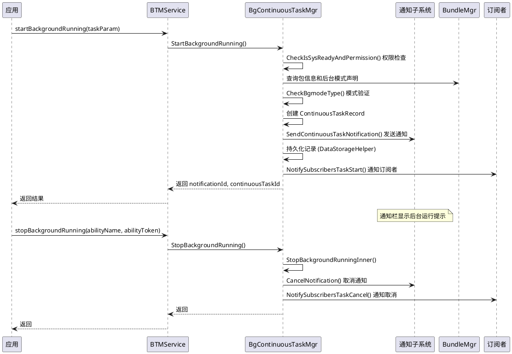
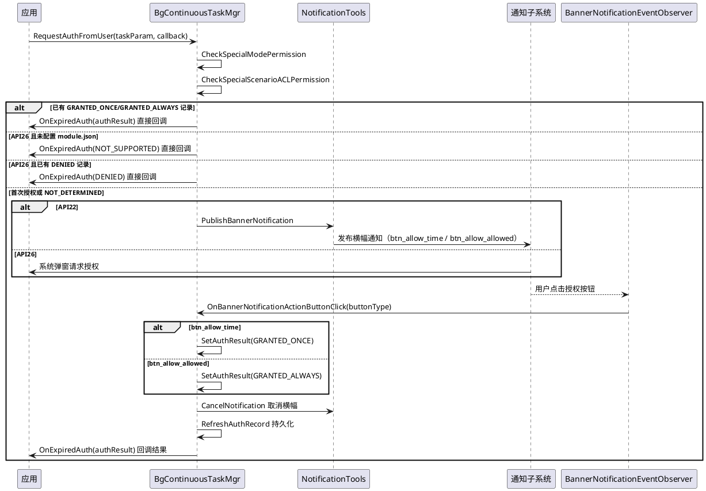
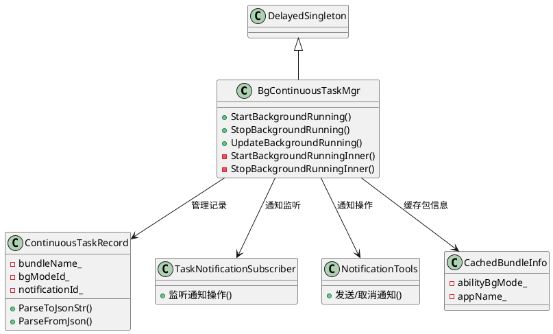

# 长时任务代码设计

> 文档版本：v1.0
> 更新时间：2026-08-19

## 上下文与场景

### 触发时机

- 服务启动后，应用调用 `startBackgroundRunning` 申请长时任务
- 可在前台或后台申请
- 支持通过内部 API（`RequestBackgroundRunningForInner`）由系统服务申请，配合 `ContinuousTaskParamForInner` 内部 API 参数结构使用

### 参与角色

| 角色　　　　　　　　　　　 | 职责　　　　　　　　　　　　　　　　　　　　　　　　　　　　　　 |
| ----------------------------| ------------------------------------------------------------------|
| 应用　　　　　　　　　　　 | 调用 `startBackgroundRunning` 申请，`stopBackgroundRunning` 取消 |
| 后台任务管理服务　　　　　 | 验证权限、检查模式、创建记录、发送通知　　　　　　　　　　　　　 |
| 通知子系统　　　　　　　　 | 强制显示通知，支持用户点击通知取消任务　　　　　　　　　　　　　 |
| TaskNotificationSubscriber | 监听通知操作（删除/点击），触发任务取消　　　　　　　　　　　　　|
| 订阅者　　　　　　　　　　 | 通过 `IBackgroundTaskSubscriber` 监听任务状态变更　　　　　　　　|
| BundleMgr　　　　　　　　　| 查询应用包信息，验证后台模式声明　　　　　　　　　　　　　　　　 |
| AccountMgr　　　　　　　　 | 监听账户状态变更　　　　　　　　　　　　　　　　　　　　　　　　 |

### 运行时序

## 知识关联

### 依赖的公共模块类

| 公共类 | 头文件 | 关联说明 |
|--------|--------|---------|
| `DataStorageHelper` | `services/common/include/data_storage_helper.h` | 长时任务记录的 JSON 持久化和重启恢复 |
| `AppStateObserver` | `services/common/include/app_state_observer.h` | 监听应用状态变化，触发任务清理 |
| `SystemEventObserver` | `services/common/include/system_event_observer.h` | 监听 Bundle 信息变更和账户状态变更 |
| `BundleManagerHelper` | `services/common/include/bundle_manager_helper.h` | 查询包信息、验证后台模式声明 |
| `CommonUtils` | `services/common/include/common_utils.h` | 后台模式检查工具 |
| `ReportHiSysEventData` | `services/common/include/report_hisysevent_data.h` | 上报任务事件 |
| `BgtaskHiTraceChain` | `services/common/include/bgtask_hitrace_chain.h` | 链路追踪 |

### 交互的外部系统服务

| 外部服务 | 交互方式 |
|---------|---------|
| 通知子系统（AnsService） | 发送/取消通知，注册通知订阅者 |
| Bundle 管理服务（BundleMgr） | 查询包信息、权限声明 |
| 账户管理服务（AccountMgr） | 监听账户状态变更 |
| 应用管理服务（AppMgr） | 查询运行进程、应用状态 |
| AVSession 服务 | 音频播放任务关联 AVSession |

### 跨子模块关联

- 长时任务和短时任务共享 `IBackgroundTaskSubscriber` 订阅者接口
- 应用死亡时 `AppStateObserver` 同时通知长时任务管理器清理记录

## 演进与版本

### 接口演进

- API12版本新增支持申请多个长时任务类型（`使用isBatchApi_标记位表示`）
- API12版本新增支持更新长时任务类型（`updateBackgroundRunning`）
- API13版本新增VOIP类型长时任务
- API15版本新增支持长时任务取消回调（`on(type: 'continuousTaskCancel', callback: Callback<ContinuousTaskCancelInfo>): void`等配套接口）
- API16版本新增支持长时任务子类型（`BackgroundSubMode`）
- API20版本新增支持获取应用自身的所有长时任务信息（`getAllContinuousTasks`）
- API20版本新增支持长时任务暂停、激活回调（`on(type: 'continuousTaskSuspend', callback: Callback<ContinuousTaskSuspendInfo>): void`等配套接口）
- API21版本新增`startBackgroundRunning(context: Context, request: ContinuousTaskRequest): Promise<ContinuousTaskNotification>`等配套接口，支持一个应用申请多个长时任务的能力
- API21版本新增 `BackgroundTaskMode` 新类型枚举（`background_task_mode.h`），替代旧 `BackgroundMode`（`background_mode.h，API21以前版本使用，服务端使用`）
- API21版本新增子模式（`BackgroundTaskSubmode`），支持更细粒度的模式声明
- API21版本新增组合通知（`isCombinedTaskNotification_`）支持，允许多个相同类型的长时任务只发一个通知
- API22版本新增支持特殊类型长时任务（`MODE_SPECIAL_SCENARIO_PROCESSING`）
- API22版本新增 `RequestAuthFromUser` / `CheckSpecialScenarioAuth` 用户授权流程，用于特殊类型长时任务（`MODE_SPECIAL_SCENARIO_PROCESSING`）用户授权弹窗
- API22版本为用户授权弹窗流程新增 `setBackgroundTaskState` / `getBackgroundTaskState` 后台任务状态控制，允许设置应用读取设置用户授权结果。
- API22版本新增`SUBMODE_AUDIO_PLAYBACK_NORMAL_NOTIFICATION`、`SUBMODE_AVSESSION_AUDIO_PLAYBACK`等多个子类型，更细粒度模式声明
- API23版本新增`obtainAllContinuousTasks`，支持系统应用获取全量长时任务信息的能力
- API26版本新增支持星闪类型长时任务（`MODE_NEARLINK`）
- 7.0版本新增 `SuspendContinuousTask` / `ActiveContinuousTask` 暂停/激活机制，长时任务因为使用不当临时被系统暂停时通知挂起，恢复后通知激活。

## 特殊场景任务授权实现

`MODE_SPECIAL_SCENARIO_PROCESSING` 特殊场景任务需要用户授权后方可运行。API 版本常量定义于 `interfaces/innerkits/include/background_common.h`：

| 常量 | 值 | 说明 |
|------|----|------|
| `API_VERSION_CHECK_SPECIAL_USER_AUTH` | 22 | 查询用户授权接口起始版本 |
| `API_VERSION_CHECK_SPECIAL_USER_AUTH_RESULT` | 26 | 查询用户授权 API26 接口 |
| `API_VERSION_REQUEST_SPECIAL_USER_AUTH` | 22 | 请求用户授权接口起始版本 |
| `API_VERSION_REQUEST_SPECIAL_USER_AUTH_BY_DIALOG` | 26 | 请求用户授权 API26 接口 |

### 资格校验实现

`CheckApplySpecial`（定义于 `bg_continuous_task_mgr.cpp`）校验应用资格：

1. 通过 `BundleManagerHelper::GetBundleInfoByFlags` 查询 `BundleInfo`（含 Abilities 和请求权限列表）
2. 非豁免应用（`BgtaskConfig::IsSpecialExemptedQuatoApp` 返回 false）检查权限声明：`reqPermissions` 须包含 `BGMODE_PERMISSION_SYSTEM` 或 `BGMODE_PERMISSION_SPECIAL_SCENARIO`
3. 非豁免应用检查 `applicationInfo.isSystemApp`，系统应用返回 false
4. 遍历 `abilityInfos`，检查 `backgroundModes` 是否包含 `SPECIAL_SCENARIO_PROCESSING` 位

权限常量定义于 `bg_continuous_task_mgr.cpp`：
- `BGMODE_PERMISSION`：`ohos.permission.KEEP_BACKGROUND_RUNNING`
- `BGMODE_PERMISSION_SPECIAL_SCENARIO`：`ohos.permission.KEEP_BACKGROUND_RUNNING_SPECIAL_SCENARIO`
- `BGMODE_PERMISSION_SYSTEM`：系统权限

### 请求授权实现

`RequestAuthFromUser`（定义于 `bg_continuous_task_mgr.cpp`）流程：

1. `CheckSpecialModePermission` 校验特殊模式唯一性和子模式匹配
2. 非豁免应用通过 `CheckSpecialScenarioACLPermission` 校验 ACL 权限，系统应用拒绝（`ERR_BGTASK_CONTINUOUS_SYSTEM_APP_NOT_SUPPORT_ACL`）
3. 创建 `ContinuousTaskRecord`，通过 `InitRecordParam` 初始化
4. `CheckAuthParam` 检查已有授权记录：
   - `bannerNotificationRecord_` 中已有 `GRANTED_ONCE` / `GRANTED_ALWAYS` → 直接回调 `OnExpiredAuth`，不弹窗
   - 已有 `NOT_SUPPORTED` → 返回 `ERR_BGTASK_CONTINUOUS_NOT_DEPLOY_SPECIAL_SCENARIO_PROCESSING`
   - API26 且已有 `DENIED` → 直接回调 `OnExpiredAuth(DENIED)`
   - API22 通过 `GetMainAbilityLabel` 获取应用名

**API22 `RequestAuthFromUserInner` 实现**：
- 创建 `BannerNotificationRecord`，设置 bundleName/uid/userId/appIndex
- `FormatBannerNotificationContext` 从资源管理获取横幅文本
- `NotificationTools::PublishBannerNotification` 发布横幅通知（按钮：`btn_allow_time` / `btn_allow_allowed`）
- 存入 `bannerNotificationRecord_` 映射表和 `expiredCallbackMap_`
- `RefreshAuthRecord` 持久化到 JSON 文件

**API26 `RequestAuthFromUserInner` 实现**：
- 先调用 `CheckApplySpecial` 检查 module.json 配置，未配置 → 直接回调 `NOT_SUPPORTED`
- **不发布横幅通知**，仅创建 `BannerNotificationRecord` 存入映射表等待系统弹窗回调

### 横幅通知按钮点击实现

`OnBannerNotificationActionButtonClickInner`（定义于 `bg_continuous_task_mgr.cpp`）：

1. 从 `bannerNotificationRecord_` 查找记录
2. `buttonType == BGTASK_BANNER_NOTIFICATION_BTN_ALLOW_TIME` → `SetAuthResult(GRANTED_ONCE)`
3. `buttonType == BGTASK_BANNER_NOTIFICATION_BTN_ALLOW_ALLOWED` → `SetAuthResult(GRANTED_ALWAYS)`
4. `RefreshAuthRecord` 更新持久化
5. `NotificationTools::CancelNotification` 取消横幅通知
6. 从 `expiredCallbackMap_` 查找回调，调用 `OnExpiredAuth(authResult)` 通知应用
7. 移除回调的死亡监听，清理 `expiredCallbackMap_`

按钮常量定义于 `g_btnBannerNotification[]`：`btn_allow_time`、`btn_allow_allowed`。

### 查询授权实现

`CheckSpecialScenarioAuth` → `CheckSpecialScenarioAuthInner`（定义于 `bg_continuous_task_mgr.cpp`）：

**API22**（`API_VERSION_CHECK_SPECIAL_USER_AUTH`）：
- 查找 `bannerNotificationRecord_`，无记录 → 返回 `ERR_BGTASK_CONTINUOUS_NOT_APPLY_AUTH_RECORD`
- 有记录 → 返回存储的 `GetAuthResult`

**API26**（`API_VERSION_CHECK_SPECIAL_USER_AUTH_RESULT`）：
- 先 `CheckApplySpecial` 检查 module.json，未配置 → 返回 `NOT_SUPPORTED`
- 查找记录，无记录 → 返回 `NOT_DETERMINED`
- 有记录 → 返回存储结果

### 设置/获取状态实现

| 方法 | 实现说明 |
|------|---------|
| `SetBackgroundTaskStateInner` | 按 bundleName/userId/appIndex 查找 `bannerNotificationRecord_`，无记录时新建 `BannerNotificationRecord` 并设置授权结果，有记录时直接 `SetAuthResult` 更新，最后 `RefreshAuthRecord` 持久化 |
| `GetBackgroundTaskStateInner` | 恶意应用（`IsMaliciousAppConfig`）直接返回 `NOT_SUPPORTED`；无记录时调用 `CheckApplySpecial`，通过返回 `NOT_DETERMINED`，不通过返回 `NOT_SUPPORTED`；有记录返回存储结果 |
| `CheckTaskAuthResultInner` | 查找 `bannerNotificationRecord_`，仅 `GRANTED_ONCE` / `GRANTED_ALWAYS` 返回 `ERR_OK`，其余返回 `ERR_BGTASK_CONTINUOUS_AUTH_NOT_PERMITTED` |
| `EnableContinuousTaskRequest` | `isEnable=true` 时从 `disableRequestUidList_` 移除 uid，`isEnable=false` 时加入 |

### 授权流程时序

### 核心数据结构

| 类名 | 头文件 | 职责 |
|------|--------|------|
| `BannerNotificationRecord` | `services/continuous_task/include/banner_notification_record.h` | 横幅通知授权记录，存储 bundleName/uid/notificationId/appName/authResult/userId/appIndex，支持 JSON 序列化与反序列化 |
| `BackgroundTaskStateInfo` | `interfaces/innerkits/include/background_task_state_info.h` | 后台任务状态信息，含 bundleName/userId/appIndex/userAuthResult，用于 `SetBackgroundTaskState` / `GetBackgroundTaskState` |
| `UserAuthResult` | `interfaces/innerkits/include/user_auth_result.h` | 授权结果枚举（NOT_SUPPORTED/NOT_DETERMINED/DENIED/GRANTED_ONCE/GRANTED_ALWAYS） |
| `AuthExpiredCallbackDeathRecipient` | `services/continuous_task/include/bg_continuous_task_mgr.h` | 授权回调远程对象死亡监听，应用死亡时清理 `expiredCallbackMap_` |
| `BannerNotificationEventObserver` | `services/continuous_task/include/bg_continuous_task_mgr.h` | 横幅通知事件观察者，监听用户点击授权按钮事件 |

### 关键方法

| 方法 | 签名 | 说明 |
|------|------|------|
| `RequestAuthFromUser` | `ErrCode RequestAuthFromUser(const sptr<ContinuousTaskParam> &taskParam, const sptr<IExpiredCallback>& callback, int32_t &notificationId)` | 请求用户授权，入口方法 |
| `CheckSpecialScenarioAuth` | `ErrCode CheckSpecialScenarioAuth(int32_t appIndex, uint32_t &authResult, int32_t apiVersion)` | 查询用户授权结果 |
| `CheckTaskAuthResult` | `ErrCode CheckTaskAuthResult(const std::string &bundleName, int32_t userId, int32_t appIndex)` | 任务检测器校验授权 |
| `SetBackgroundTaskState` | `ErrCode SetBackgroundTaskState(std::shared_ptr<BackgroundTaskStateInfo> taskParam)` | 设置后台任务状态 |
| `GetBackgroundTaskState` | `ErrCode GetBackgroundTaskState(std::shared_ptr<BackgroundTaskStateInfo> taskParam, uint32_t &authResult)` | 获取后台任务状态 |
| `EnableContinuousTaskRequest` | `ErrCode EnableContinuousTaskRequest(int32_t uid, bool isEnable)` | 启用/禁用连续任务请求 |

## 数据模型

### ContinuousTaskCallbackInfo

长时任务回调信息，定义于 `interfaces/innerkits/include/continuous_task_callback_info.h`：

| 字段 | 类型 | 说明 | 适用回调 |
|------|------|------|---------|
| `typeId_` | `uint32_t` | 单个类型 ID（API9） | Start/Stop |
| `typeIds_` | `vector[uint32_t]` | 类型 ID 列表（API12+） | Start/Update/Stop |
| `backgroundSubModes_` | `vector[uint32_t]` | 子模式列表（API16+） | Start/Update |
| `creatorUid_` | `int32_t` | 创建者 UID | 全部 |
| `creatorPid_` | `pid_t` | 创建者 PID | 全部 |
| `abilityName_` | `std::string` | Ability 名称 | 全部 |
| `isFromWebview_` | `bool` | 是否来自 inner 接口 | 全部 |
| `isBatchApi_` | `bool` | 是否批量 API（API12+） | 全部 |
| `isByRequestObject_` | `bool` | 是否 API21 请求对象接口 | 全部 |
| `continuousTaskId_` | `int32_t` | 长时任务 ID | 全部 |
| `cancelReason_` | `int32_t` | 取消原因 | Stop |
| `detailedCancelReason_` | `int32_t` | 详细取消原因 | Stop |
| `suspendState_` | `bool` | 暂停状态 | Suspend/Active |
| `suspendReason_` | `int32_t` | 暂停原因 | Suspend |
| `cancelCallBackSelf_` | `bool` | 是否回调给发起方 | Stop |
| `isStandby_` | `bool` | 是否临时管控场景 | Suspend/Active |
| `tokenId_` | `uint64_t` | Token ID | 全部 |
| `bundleName_` | `std::string` | 包名 | 全部 |
| `userId_` | `int32_t` | 用户 ID | 全部 |
| `appIndex_` | `int32_t` | 应用索引 | 全部 |
| `notificationId_` | `int32_t` | 通知 ID | Start/Update |
| `wantAgentBundleName_` | `std::string` | WantAgent 包名 | Start/Update |

### ContinuousTaskInfo

长时任务信息（对外），定义于 `interfaces/innerkits/include/continuous_task_info.h`：

| 字段　　　　　　　　　　| 类型　　　　　　| 说明　　　　　　　　　　　 |
| -------------------------| -----------------| ----------------------------|
| `abilityName_`　　　　　| `std::string`　 | Ability 名称　　　　　　　 |
| `uid_`　　　　　　　　　| `int32_t`　　　 | UID　　　　　　　　　　　　|
| `pid_`　　　　　　　　　| `int32_t`　　　 | 进程 ID　　　　　　　　　　|
| `isFromWebView_`　　　　| `bool`　　　　　| 是否来自inner接口申请　　　|
| `backgroundModes_`　　　| `uint32_t 列表` | 后台类型列表　　　　　　　 |
| `backgroundSubModes_`　 | `uint32_t 列表` | 后台子类型列表　　　　　　 |
| `notificationId_`　　　 | `int32_t`　　　 | 通知 ID，默认 -1　　　　　 |
| `continuousTaskId_`　　 | `int32_t`　　　 | 长时任务 ID，默认 -1　　　 |
| `abilityId_`　　　　　　| `int32_t`　　　 | Ability ID，默认 -1　　　　|
| `wantAgentBundleName_`　| `std::string`　 | WantAgent 包名　　　　　　 |
| `wantAgentAbilityName_` | `std::string`　 | WantAgent Ability 名称　　 |
| `suspendState_`　　　　 | `bool`　　　　　| 暂停状态　　　　　　　　　 |
| `bundleName_`　　　　　 | `std::string`　 | 包名　　　　　　　　　　　 |
| `appIndex_`　　　　　　 | `int32_t`　　　 | 应用索引，用于应用分身场景 |
| `isByRequestObject_`　　| `bool`　　　　　| 是否通过API21接口申请　　　|

### ContinuousTaskParam

长时任务参数，定义于 `interfaces/innerkits/include/continuous_task_param.h`：

| 字段 | 类型 | 说明 |
|------|------|------|
| `isNewApi_` | `bool` | 是否stage模型API |
| `bgModeId_` | `uint32_t` | 长时任务类型ID，供API9接口使用 |
| `wantAgent_` | `shared_ptr[WantAgent]` | WantAgent |
| `abilityName_` | `std::string` | Ability 名称 |
| `abilityToken_` | `sptr[IRemoteObject]` | Ability Token |
| `appName_` | `std::string` | 应用名称 |
| `isBatchApi_` | `bool` | 是否通过API12接口申请 |
| `bgModeIds_` | `uint32_t 列表` | 长时任务类型ID列表 |
| `abilityId_` | `int32_t` | Ability ID |
| `bgSubModeIds_` | `uint32_t 列表` | 长时任务子类型ID列表 |
| `isCombinedTaskNotification_` | `bool` | 是否合并通知 |
| `combinedNotificationTaskId_` | `int32_t` | 合并通知的主任务 ID |
| `isByRequestObject_` | `bool` | 是否通过API21接口申请 |
| `appIndex_` | `int32_t` | 应用索引，用于应用分身场景 |

### ContinuousTaskRecord

长时任务内部记录，定义于 `services/continuous_task/include/continuous_task_record.h`：

| 字段　　　　　　　　　　　　　 | 类型　　　　　　| 说明　　　　　　　　　　　　　　　　　　　　|
| --------------------------------| -----------------| ---------------------------------------------|
| `bundleName_`　　　　　　　　　| `std::string`　 | 包名　　　　　　　　　　　　　　　　　　　　|
| `abilityName_`　　　　　　　　 | `std::string`　 | Ability 名称　　　　　　　　　　　　　　　　|
| `userId_`　　　　　　　　　　　| `int32_t`　　　 | 用户 ID　　　　　　　　　　　　　　　　　　 |
| `uid_`　　　　　　　　　　　　 | `int32_t`　　　 | UID　　　　　　　　　　　　　　　　　　　　 |
| `pid_`　　　　　　　　　　　　 | `pid_t`　　　　 | 进程 ID　　　　　　　　　　　　　　　　　　 |
| `bgModeId_`　　　　　　　　　　| `uint32_t`　　　| 长时任务类型ID，供API9接口使用　　　　　　　|
| `isNewApi_`　　　　　　　　　　| `bool`　　　　　| 是否stage模型API　　　　　　　　　　　　　　|
| `isFromWebview_`　　　　　　　 | `bool`　　　　　| 是否来自inner接口申请　　　　　　　　　　　 |
| `needNotificationForInnerApi_` | `bool`　　　　　| 通过inner接口申请的长时任务是否需要发送通知 |
| `notificationLabel_`　　　　　 | `std::string`　 | 通知标签　　　　　　　　　　　　　　　　　　|
| `notificationId_`　　　　　　　| `int32_t`　　　 | 通知 ID　　　　　　　　　　　　　　　　　　 |
| `subNotificationLabel_`　　　　| `std::string`　 | 子通知标签　　　　　　　　　　　　　　　　　|
| `subNotificationId_`　　　　　 | `int32_t`　　　 | 子通知 ID　　　　　　　　　　　　　　　　　 |
| `appName_`　　　　　　　　　　 | `std::string`　 | 应用名称　　　　　　　　　　　　　　　　　　|
| `isBatchApi_`　　　　　　　　　| `bool`　　　　　| 是否通过API12接口申请　　　　　　　　　　　 |
| `bgModeIds_`　　　　　　　　　 | `uint32_t 列表` | 长时任务类型列表　　　　　　　　　　　　　　|
| `bgSubModeIds_`　　　　　　　　| `uint32_t 列表` | 长时任务子类型列表　　　　　　　　　　　　　|
| `abilityId_`　　　　　　　　　 | `int32_t`　　　 | Ability ID　　　　　　　　　　　　　　　　　|
| `reason_`　　　　　　　　　　　| `int32_t`　　　 | 取消原因　　　　　　　　　　　　　　　　　　|
| `detailedCancelReason_`　　　　| `int32_t`　　　 | 详细取消原因　　　　　　　　　　　　　　　　|
| `isSystem_`　　　　　　　　　　| `bool`　　　　　| 是否系统应用　　　　　　　　　　　　　　　　|
| `continuousTaskId_`　　　　　　| `int32_t`　　　 | 长时任务 ID　　　　　　　　　　　　　　　　 |
| `suspendState_`　　　　　　　　| `bool`　　　　　| 暂停状态　　　　　　　　　　　　　　　　　　|
| `suspendReason_`　　　　　　　 | `int32_t`　　　 | 暂停原因　　　　　　　　　　　　　　　　　　|
| `suspendAudioTaskTimes_`　　　 | `int32_t`　　　 | 音频任务暂停次数　　　　　　　　　　　　　　|
| `isCombinedTaskNotification_`　| `bool`　　　　　| 是否合并通知　　　　　　　　　　　　　　　　|
| `isByRequestObject_`　　　　　 | `bool`　　　　　| 是否通过API21接口申请　　　　　　　　　　　 |
| `appIndex_`　　　　　　　　　　| `int32_t`　　　 | 应用索引，用于应用分身场景　　　　　　　　　|
| `isStandby_`　　　　　　　　　 | `bool`　　　　　| 标记是否是系统临时管控场景的suspend回调　　 |
| `isStandbySuspend_`　　　　　　| `bool`　　　　　| 系统临时管控场景去重标记　　　　　　　　　　|

## 代码与符号

### 核心类

| 类名 | 头文件 | 职责 |
|------|--------|------|
| `BgContinuousTaskMgr` | `services/continuous_task/include/bg_continuous_task_mgr.h` | 长时任务主管理器 |
| `ContinuousTaskRecord` | `services/continuous_task/include/continuous_task_record.h` | 长时任务内部记录 |
| `TaskNotificationSubscriber` | `services/continuous_task/include/task_notification_subscriber.h` | 通知订阅者，监听通知操作 |
| `NotificationTools` | `services/continuous_task/include/notification_tools.h` | 通知工具类 |
| `BgContinuousTaskDumper` | `services/continuous_task/include/bg_continuous_task_dumper.h` | Dump 工具类 |
| `RemoteDeathRecipient` | `services/continuous_task/include/remote_death_recipient.h` | 远程对象死亡监听 |
| `BannerNotificationRecord` | `services/continuous_task/include/banner_notification_record.h` | 横幅通知记录 |

### 关键方法

| 方法 | 签名 | 说明 |
|------|------|------|
| `StartBackgroundRunning` | `ErrCode StartBackgroundRunning(const sptr[ContinuousTaskParam] &taskParam)` | 开始长时任务 |
| `UpdateBackgroundRunning` | `ErrCode UpdateBackgroundRunning(const sptr[ContinuousTaskParam] &taskParam)` | 更新长时任务模式 |
| `StopBackgroundRunning` | `ErrCode StopBackgroundRunning(const std::string &abilityName, int32_t abilityId, int32_t continuousTaskId = -1)` | 停止长时任务 |
| `GetAllContinuousTasks` | `ErrCode GetAllContinuousTasks(vector[ContinuousTaskInfo] &list)` | 查询长时任务 |
| `RequestBackgroundRunningForInner` | `ErrCode RequestBackgroundRunningForInner(const sptr[ContinuousTaskParamForInner] &taskParam)` | 内部 API 申请 |
| `RequestAuthFromUser` | `ErrCode RequestAuthFromUser(...)` | 请求用户授权 |
| `StopContinuousTask` | `void StopContinuousTask(int32_t uid, int32_t pid, uint32_t taskType, const std::string &key)` | 停止长时任务 |
| `SuspendContinuousTask` | `void SuspendContinuousTask(int32_t uid, int32_t pid, int32_t reason, const std::string &key, bool isStandby = false)` | 暂停长时任务 |
| `ActiveContinuousTask` | `void ActiveContinuousTask(int32_t uid, int32_t pid, const std::string &key, bool isStandby = false)` | 激活长时任务 |

### 事件类型

`ContinuousTaskEventTriggerType` 枚举（定义于 `bg_continuous_task_mgr.h`）：

| 枚举值 | 说明 |
|--------|------|
| `TASK_START` | 任务开始 |
| `TASK_UPDATE` | 任务更新 |
| `TASK_CANCEL` | 任务取消 |
| `TASK_SUSPEND` | 任务暂停 |
| `TASK_ACTIVE` | 任务激活 |

### 类继承调用关系

## 关键数据标记

长时任务的实现通过一组布尔/枚举标记位与字段来区分调用来源、API 版本路径、通知策略与暂停态。这些标记位随 API 演进逐步引入，决定了 `ContinuousTaskRecord` 的构造方式与生命周期管理路径。

### 标记位与字段定义

| 标记/字段 | 所在位置 | 类型 | 引入版本 | 含义 |
|----------|---------|------|---------|------|
| `isNewApi_` | `ContinuousTaskParam` / `ContinuousTaskRecord` | `bool` | API9 | 区分 FA 模型与 Stage 模型申请路径。`true` 表示 Stage 模型（新 API），`false` 表示 FA 模型（旧 API） |
| `isBatchApi_` | `BgContinuousTaskMgr` / `ContinuousTaskParam` | `bool` | API12 | 批量 API 标记。`true` 表示一次申请多个长时任务类型，对应 `bgModeIds_` 列表；`false` 表示单类型申请 |
| `bgModeId_` | `ContinuousTaskRecord` | `uint32_t` | API9 | 单一后台模式 ID（旧 API） |
| `bgModeIds_` | `ContinuousTaskRecord` | `vector<uint32_t>` | API12 | 多类型后台模式 ID 列表（新批量 API） |
| `isByRequestObject_` | `BgContinuousTaskMgr` | `bool` | API21 | 请求对象接口标记。`true` 表示通过 `ContinuousTaskRequest` 对象方式申请，支持一个应用申请多个长时任务 |
| `isCombinedTaskNotification_` | `BgContinuousTaskMgr` / `ContinuousTaskRecord` | `bool` | API21 | 组合通知标记。`true` 表示多个相同类型长时任务共用一个通知 |
| `combinedNotificationTaskId_` | `ContinuousTaskRecord` | `int32_t` | API21 | 组合通知任务 ID，标识共享同一条通知的任务组 |
| `isFromWebview_` | `ContinuousTaskParamForInner` | `bool` | inner 接口 | 标记由 Webview 内部接口申请，影响通知展示策略 |
| `needNotificationForInnerApi_` | `ContinuousTaskParamForInner` | `bool` | inner 接口 | 标记 inner 接口申请是否需要发送通知 |
| `isSystem_` | `BgContinuousTaskMgr` / `ContinuousTaskRecord` | `bool` | 系统应用 | 标记调用者为系统应用，影响权限校验与通知策略 |
| `suspendState_` | `ContinuousTaskRecord` | `bool` / `int32_t` | API20 | 暂停状态标记，记录任务是否被系统暂停 |
| `suspendReason_` | `ContinuousTaskRecord` | `int32_t` | API20 | 暂停原因，配合 `suspendState_` 标识暂停来源 |
| `suspendAudioTaskTimes_` | `BgContinuousTaskMgr` | 计数 | API20 | 音频任务暂停次数计数，用于音频类任务的多次暂停/激活管理 |
| `isStandby_` | `ContinuousTaskRecord` | `bool` | 系统管控 | 系统临时管控场景标记，标识当前暂停是否由系统临时管控触发 |
| `isStandbySuspend_` | `ContinuousTaskRecord` | `bool` | 系统管控 | 系统临时管控下的挂起态，区分普通暂停与管控态暂停 |
| `bgSubModeIds_` | `ContinuousTaskRecord` | `vector<uint32_t>` | API16 | 后台子模式 ID 列表，支持更细粒度的模式声明 |
| `appIndex_` | `ContinuousTaskRecord` | `int32_t` | 应用分身 | 应用分身场景下的实例索引，区分同一包名的不同实例 |
| `notificationLabel_` | `BgContinuousTaskMgr` / `ContinuousTaskRecord` | `string` | 通用 | 通知标签，格式 `{bundleName}_{userId}_{appIndex}`，用于通知分流与取消 |

### 各标记位在不同 API 版本下的行为差异

| 标记位 | API9 | API12 | API16 | API20 | API21 | API22+ | 7.0 |
|--------|------|-------|-------|-------|-------|--------|-----|
| `isNewApi_` | 区分 FA/Stage 模型 | 行为一致 | 行为一致 | 行为一致 | 行为一致 | 行为一致 | 行为一致 |
| `isBatchApi_` | 不存在 | 引入，支持多类型 | 行为一致 | 行为一致 | 配合 `isByRequestObject_` 共存 | 行为一致 | 行为一致 |
| `bgModeId_` | 单类型主字段 | 与 `bgModeIds_` 并存 | 与 `bgSubModeIds_` 并存 | 行为一致 | 与 `isByRequestObject_` 路径并存 | 行为一致 | 行为一致 |
| `bgModeIds_` | 不存在 | 引入，多类型列表 | 行为一致 | 行为一致 | 成为请求对象接口主字段 | 行为一致 | 行为一致 |
| `bgSubModeIds_` | 不存在 | 不存在 | 引入子类型 | 行为一致 | 配合 `BackgroundTaskSubmode` 扩展 | 新增多个子类型 | 行为一致 |
| `isByRequestObject_` | 不存在 | 不存在 | 不存在 | 不存在 | 引入，`ContinuousTaskRequest` 路径 | 行为一致 | 行为一致 |
| `isCombinedTaskNotification_` | 不存在 | 不存在 | 不存在 | 不存在 | 引入，组合通知 | 行为一致 | 行为一致 |
| `combinedNotificationTaskId_` | 不存在 | 不存在 | 不存在 | 不存在 | 引入，标识任务组 | 行为一致 | 行为一致 |
| `isFromWebview_` | inner 接口标记 | 行为一致 | 行为一致 | 行为一致 | 行为一致 | 行为一致 | 行为一致 |
| `needNotificationForInnerApi_` | inner 接口标记 | 行为一致 | 行为一致 | 行为一致 | 行为一致 | 行为一致 | 行为一致 |
| `isSystem_` | 系统应用判定 | 行为一致 | 行为一致 | 行为一致 | 行为一致 | 配合授权流程 | 行为一致 |
| `suspendState_` | 不存在 | 不存在 | 不存在 | 引入暂停机制 | 行为一致 | 行为一致 | 与 `SuspendContinuousTask` 联动 |
| `suspendReason_` | 不存在 | 不存在 | 不存在 | 引入 | 行为一致 | 行为一致 | 与 7.0 暂停/激活机制联动 |
| `suspendAudioTaskTimes_` | 不存在 | 不存在 | 不存在 | 引入音频计数 | 行为一致 | 行为一致 | 行为一致 |
| `isStandby_` | 不存在 | 不存在 | 不存在 | 系统管控标记 | 行为一致 | 行为一致 | 与临时管控联动 |
| `isStandbySuspend_` | 不存在 | 不存在 | 不存在 | 系统管控标记 | 行为一致 | 行为一致 | 与临时管控联动 |
| `appIndex_` | 分身索引 | 行为一致 | 行为一致 | 行为一致 | 行为一致 | 行为一致 | 行为一致 |
| `notificationLabel_` | `{bundle}_{userId}_{appIndex}` | 行为一致 | 行为一致 | 行为一致 | 组合通知复用 | 行为一致 | 行为一致 |

### 关键标记位语义说明

**`isNewApi_`（API9）**
FA 模型与 Stage 模型的申请路径差异：FA 模型通过 `wantAgent` 方式申请，Stage 模型通过 `Context` + `ContinuousTaskParam` 方式申请。该标记决定 `ContinuousTaskRecord` 的字段填充路径与通知构建方式。

**`isBatchApi_` 与 `bgModeId_` / `bgModeIds_`（API12）**
- API9 单类型路径：仅填充 `bgModeId_`，一次申请一个后台模式
- API12 批量路径：`isBatchApi_ = true`，填充 `bgModeIds_` 列表，一次申请多个后台模式；`updateBackgroundRunning` 通过更新该列表实现模式变更
- 旧字段 `bgModeId_` 与新字段 `bgModeIds_` 在 `ContinuousTaskRecord` 中并存，持久化与反序列化均需兼容两者

**`isByRequestObject_`（API21）**
通过 `ContinuousTaskRequest` 对象方式申请，支持一个应用同时持有多个长时任务。该路径与旧 `ContinuousTaskParam` 路径并存，服务端通过此标记区分记录创建与通知策略。

**`isCombinedTaskNotification_` + `combinedNotificationTaskId_`（API21）**
允许多个相同类型的长时任务共享一条通知：当多个任务的 `bgModeIds_` 类型相同时，`isCombinedTaskNotification_` 置 `true`，共用同一 `combinedNotificationTaskId_` 对应的通知；取消任一任务不取消通知，直至该类型最后一个任务结束才取消通知。

**`isFromWebview_` / `needNotificationForInnerApi_`（inner 接口）**
- `isFromWebview_`：标记由 Webview 通过内部接口申请，可能影响通知的展示策略（如隐藏通知或改用 Webview 自有提示）
- `needNotificationForInnerApi_`：控制 inner 接口申请是否发送系统通知，部分系统服务场景需静默运行不展示通知

**`isSystem_`（系统应用）**
标记调用者为系统应用，影响：权限校验放宽、通知策略可差异化、部分模式仅系统应用可申请。

**`suspendState_` + `suspendReason_`（API20）与 `isStandby_` / `isStandbySuspend_`**
- API20 引入暂停机制：`SuspendContinuousTask` 置 `suspendState_ = true` 并记录 `suspendReason_`，`ActiveContinuousTask` 复位
- `isStandby_` / `isStandbySuspend_` 标识系统临时管控场景下的暂停，与普通使用不当暂停区分，恢复策略不同
- 7.0 版本的 `SuspendContinuousTask` / `ActiveContinuousTask` 在 API20 基础上完善为完整的暂停/激活回调流程，通过 `continuousTaskSuspend` 事件通知应用

**`suspendAudioTaskTimes_`（API20）**
音频类长时任务可能被多次暂停/激活，该计数器记录暂停次数，用于音频任务的多次暂停管理与激活判定。

**`bgSubModeIds_`（API16）**
子模式 ID 列表，配合 `BackgroundSubMode` 枚举使用，支持更细粒度的模式声明。API22 进一步新增 `SUBMODE_AUDIO_PLAYBACK_NORMAL_NOTIFICATION`、`SUBMODE_AVSESSION_AUDIO_PLAYBACK` 等子类型。

**`appIndex_` 与 `notificationLabel_`（应用分身）**
- `appIndex_` 标识应用分身实例，同一 `bundleName` 下不同 `appIndex` 视为不同应用实例
- `notificationLabel_` 格式 `{bundleName}_{userId}_{appIndex}` 作为通知标签，确保分身场景下通知正确分流与取消
