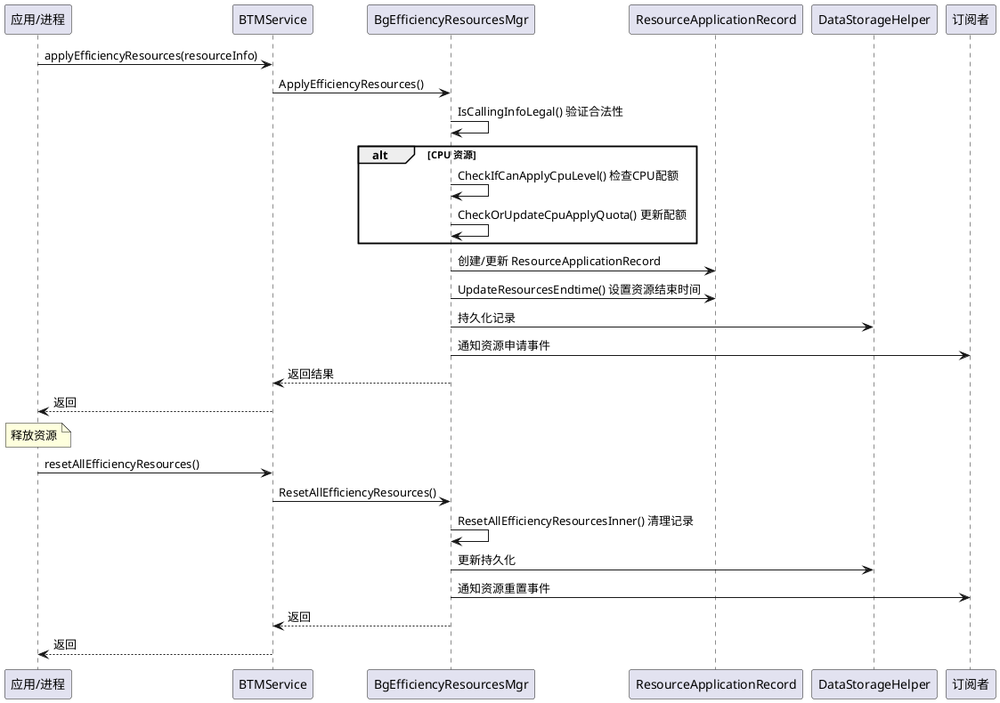
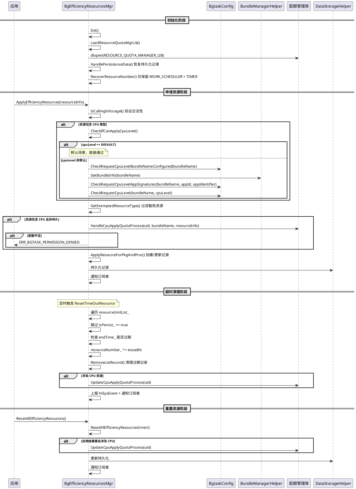
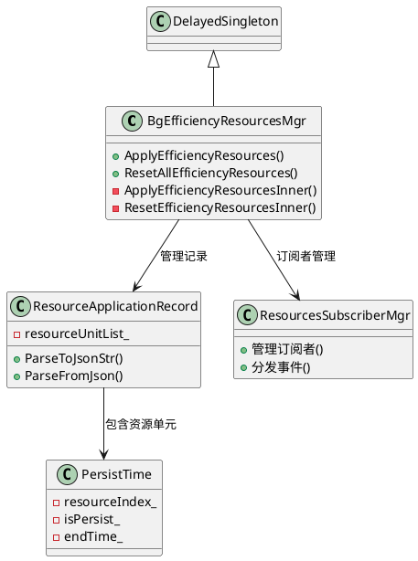

# 能效资源代码设计

> 文档版本：v1.0
> 更新时间：2026-08-19

## 上下文与场景

### 触发时机

- 应用或进程需要后台资源特权时调用 `applyEfficiencyResources` 申请
- 可在前台或后台申请
- 系统服务可通过内部接口参与进程级资源管理

### 参与角色

| 角色　　　　　　　　　 | 职责　　　　　　　　　　　　　　　　　　　　　　　　　　　　　　　　　　　　　　 |
| ------------------------| ----------------------------------------------------------------------------------|
| 应用　　　　　　　　　 | 调用 `applyEfficiencyResources` 申请资源，`resetAllEfficiencyResources` 释放资源 |
| 进程　　　　　　　　　 | 以进程身份申请资源（`isProcess_ = true`）　　　　　　　　　　　　　　　　　　　　|
| 后台任务管理服务　　　 | 验证调用合法性、检查 CPU 配额、创建/更新记录、通知订阅者　　　　　　　　　　　　 |
| ResourcesSubscriberMgr | 管理能效资源订阅者，分发资源变更事件　　　　　　　　　　　　　　　　　　　　　　 |
| AppMgrHelper　　　　　 | 查询运行进程列表，校验应用存活状态　　　　　　　　　　　　　　　　　　　　　　　 |
| 订阅者　　　　　　　　 | 通过 `IBackgroundTaskSubscriber` 监听资源申请/重置事件　　　　　　　　　　　　　 |

### 运行时序

### 配额流程总览

### 配额实现流程

#### 配额管理库动态加载

CPU 配额管理通过外部动态库实现，在服务初始化时加载：

- `LoadResourceQuotaMgrLib()`：使用 `dlopen` 动态加载配额管理库
- `resourceQuotaMgrHandle_`：存储加载后的库句柄
- 如果库不存在，所有配额检查默认通过

加载的库提供以下接口（通过 `dlsym` 获取函数指针）：

| 函数符号 | 调用方 | 签名 | 说明 |
|----------|--------|------|------|
| `HandleCpuApplyQuotaProcess` | `CheckOrUpdateCpuApplyQuota` | `bool (int32_t uid, const string &bundleName, const sptr[EfficiencyResourceInfo] &)` | 检查并更新 CPU 申请配额 |
| `UpdateCpuApplyQuotaProcess` | `UpdateQuotaIfCpuReset` | `void (int32_t uid)` | 资源重置后更新配额 |
| `GetCpuApplyQuotaProcess` | `DumpGetCpuQuota` | `void (int32_t uid, string列表 &)` | 获取配额信息 |
| `SetCpuApplyQuotaProcess` | `DumpSetCpuQuota` | `void (int32_t uid, uint32_t quotaPerRequest, uint32_t quotaPerDay)` | 设置配额参数 |
| `ResetCpuApplyQuotaUsageProcess` | `DumpResetCpuQuotaUsage` | `void (int32_t uid)` | 重置配额使用量 |

#### 配额检查流程

`CheckIfCanApplyCpuLevel` 在申请资源时执行：

1. 如果资源不包含 CPU 类型 → 设置 `cpuLevel_` 为 `DEFAULT`，返回 OK
2. 如果 `cpuLevel_` 为 `DEFAULT` → 返回 OK（兼容默认场景）
3. 检查应用是否在 CCM 配置中（`CheckRequestCpuLevelBundleNameConfigured`）
4. 获取 Bundle 信息并校验应用签名（`CheckRequestCpuLevelAppSignatures`）
5. 检查申请的 CPU 级别是否允许（`CheckRequestCpuLevel`）

#### 配额更新流程

`CheckOrUpdateCpuApplyQuota` 在通过级别检查后执行：

- 跳过条件：进程级资源、不包含 CPU 类型、申请且持久、配额管理库未加载
- 调用 `HandleCpuApplyQuotaProcess(uid, bundleName, resourceInfo)` 检查配额
- 返回 `false` 时申请失败

#### 配额重置流程

`UpdateQuotaIfCpuReset` 在资源被释放时执行：

- 触发条件：事件类型为 `APP_RESOURCE_RESET` 且资源包含 CPU 类型
- 调用 `UpdateCpuApplyQuotaProcess(uid)` 恢复配额

#### 超时资源清理流程

`ResetTimeOutResource` 定时清理过期的非持久资源：

1. 遍历 `ResourceApplicationRecord` 的 `resourceUnitList_`
2. 跳过持久资源（`isPersist_ == true`）
3. 检查 `endTime_` 是否已过期
4. 构建 `eraseBit` 位掩码，通过 `resourceNumber_ ^= eraseBit` 更新资源编号
5. 调用 `RemoveListRecord` 删除过期记录
6. 如果涉及 CPU 资源，调用 `UpdateQuotaIfCpuReset` 恢复配额

#### 重启恢复流程

`RecoverResourceNumber` 在服务重启时恢复资源记录：

- 仅在系统启动后 4 分钟内执行
- 仅保留 `WORK_SCHEDULER` 和 `TIMER` 资源
- 其他资源类型全部清除

#### Dump 配额管理命令

| Dump 参数 | 函数符号 | 参数 | 说明 |
|-----------|---------|------|------|
| `set_cpu_quota` | `SetCpuApplyQuotaProcess` | uid, quotaPerRequest, quotaPerDay | 设置应用配额 |
| `reset_cpu_quota_usage` | `ResetCpuApplyQuotaUsageProcess` | uid | 重置配额使用量 |
| `get_cpu_quota` | `GetCpuApplyQuotaProcess` | uid | 获取配额信息 |

## 知识关联

### 依赖的公共模块类

| 公共类 | 头文件 | 关联说明 |
|--------|--------|---------|
| `DataStorageHelper` | `services/common/include/data_storage_helper.h` | 能效资源记录的 JSON 持久化和重启恢复 |
| `BundleManagerHelper` | `services/common/include/bundle_manager_helper.h` | 通过 UID 获取 Bundle 名称，判断系统应用 |
| `AppMgrHelper` | `services/common/include/app_mgr_helper.h` | 查询运行进程列表，校验应用存活 |
| `ReportHiSysEventData` | `services/common/include/report_hisysevent_data.h` | 上报资源申请/重置事件 |
| `CommonUtils` | `services/common/include/common_utils.h` | 通用工具 |

### 交互的外部系统服务

| 外部服务 | 交互方式 |
|---------|---------|
| 应用管理服务（AppMgr） | 查询运行进程列表、进程死亡通知 |
| Bundle 管理服务（BundleMgr） | 查询包信息、系统应用判断 |
| 资源配额管理库 | 动态加载 `resourceQuotaMgrHandle_`，CPU 配额管理 |

## 演进与版本

### 接口演进

- 新增 `RUNNING_LOCK` (128) 和 `SENSOR` (256) 资源类型
- 新增 CPU Level 机制（`EfficiencyResourcesCpuLevel`），支持分级 CPU 资源申请
- 新增资源配额管理库动态加载（`LoadResourceQuotaMgrLib`），支持 CPU 配额动态调整
- 新增 `GetAllEfficiencyResources` 查询接口
- 重启恢复 cpuLevel 信息
- API20版本新增支持获取应用自身的所有能效资源信息（`getAllEfficiencyResources`）

## 数据模型

### EfficiencyResourceInfo

能效资源申请信息（对外），定义于 `interfaces/innerkits/include/efficiency_resource_info.h`：

| 字段 | 类型 | 说明 |
|------|------|------|
| `resourceNumber_` | `uint32_t` | 资源编号（位掩码组合） |
| `isApply_` | `bool` | 是否申请（true=申请，false=释放） |
| `timeOut_` | `uint32_t` | 超时时间（秒） |
| `reason_` | `std::string` | 申请原因 |
| `isPersist_` | `bool` | 是否持久，默认 false |
| `isProcess_` | `bool` | 是否进程级申请，默认 false |
| `uid_` | `int32_t` | 用户 ID，默认 -1 |
| `pid_` | `int32_t` | 进程 ID，默认 -1 |
| `cpuLevel_` | `EfficiencyResourcesCpuLevel::Type` | CPU 级别，默认 DEFAULT |

### ResourceCallbackInfo

资源回调信息，定义于 `interfaces/innerkits/include/resource_callback_info.h`：

| 字段 | 类型 | 说明 |
|------|------|------|
| `uid_` | `int32_t` | 用户 ID |
| `pid_` | `int32_t` | 进程 ID |
| `resourceNumber_` | `uint32_t` | 资源编号 |
| `bundleName_` | `std::string` | 包名 |
| `cpuLevel_` | `EfficiencyResourcesCpuLevel::Type` | CPU 级别 |

### ResourceApplicationRecord

资源申请记录（内部），定义于 `services/efficiency_resources/include/resource_application_record.h`：

| 字段 | 类型 | 说明 |
|------|------|------|
| `uid_` | `int32_t` | 用户 ID |
| `pid_` | `int32_t` | 进程 ID |
| `resourceNumber_` | `uint32_t` | 资源编号 |
| `cpuLevel_` | `EfficiencyResourcesCpuLevel::Type` | CPU 级别 |
| `bundleName_` | `std::string` | 包名 |
| `resourceUnitList_` | `PersistTime 列表` | 资源单元列表 |

### PersistTime

持久时间信息（内部），定义于 `services/efficiency_resources/include/resource_application_record.h`：

| 字段 | 类型 | 说明 |
|------|------|------|
| `resourceIndex_` | `uint32_t` | 资源索引 |
| `isPersist_` | `bool` | 是否持久 |
| `endTime_` | `int64_t` | 结束时间戳 |
| `reason_` | `std::string` | 申请原因 |
| `timeOut_` | `int64_t` | 超时时长 |

## 代码与符号

### 核心类

| 类名　　　　　　　　　　　　| 职责　　　　　　 |
| -----------------------------| ------------------|
| `BgEfficiencyResourcesMgr`　| 能效资源主管理器 |
| `ResourceApplicationRecord` | 资源申请记录　　 |
| `ResourcesSubscriberMgr`　　| 订阅者管理器　　 |
| `PersistTime`　　　　　　　 | 持久时间信息　　 |

### 内部数据结构

`BgEfficiencyResourcesMgr` 维护两个维度的资源申请映射表：

| 成员　　　　　　　　　　| 类型　　　　　　　　　　　　　　　　　　 | 说明　　　　　　　　　　　　　|
| -------------------------| ------------------------------------------| -------------------------------|
| `appResourceApplyMap_`　| `int32_t→ResourceApplicationRecord 映射` | 应用级资源申请映射（key=uid） |
| `procResourceApplyMap_` | `int32_t→ResourceApplicationRecord 映射` | 进程级资源申请映射（key=pid） |

### 类继承调用关系

## 关键数据标记

能效资源通过位掩码组合、布尔标记与配额字段来管理资源申请维度、持久性与 CPU 分级。这些标记决定了资源记录的创建、清理与配额扣减路径，并在新增资源类型与 CPU Level 机制后存在行为差异。

### 标记位与字段定义

| 标记/字段 | 所在位置 | 类型 | 含义 |
|----------|---------|------|------|
| `resourceNumber_` | `ResourceApplicationRecord` | `uint32_t` | 资源编号位掩码组合，多个资源类型通过按位或组合为单一数值，支持一次申请多种资源 |
| `isPersist_` | `PersistTime` / `ResourceApplicationRecord` | `bool` | 持久资源标记。`true` 表示该资源长期有效不超时；同一资源位上持久申请覆盖非持久申请 |
| `isProcess_` | `EfficiencyResourceInfo` | `bool` | 进程级申请标记。`true` 表示以进程身份申请，记录写入 `procResourceApplyMap_`；`false` 表示应用级，写入 `appResourceApplyMap_` |
| `isApply_` | `EfficiencyResourceInfo` | `bool` | 申请/释放标记。`true` 表示申请资源，`false` 表示释放指定资源 |
| `cpuLevel_` | `EfficiencyResourceInfo` / `ResourceApplicationRecord` | `int32_t` / 枚举 | CPU 级别，取值 `DEFAULT` / `SMALL_CPU` / `MEDIUM_CPU` / `LARGE_CPU`，影响 CPU 配额校验与扣减路径 |
| `timeOut_` | `EfficiencyResourceInfo` | `int32_t` | 超时时间（毫秒），非持久资源的有效时长，用于计算 `endTime_` |
| `endTime_` | `PersistTime` | `int64_t` | 结束时间戳（毫秒），资源到期时刻，超时清理流程依据该值判定是否过期 |
| `resourceIndex_` | `PersistTime` | `uint32_t` | 资源索引，标识 `PersistTime` 对应的资源位，用于持久时间信息与资源位的映射 |
| `appResourceApplyMap_` | `BgEfficiencyResourcesMgr` | `map` | 应用级资源申请映射表（key=uid），维护所有应用维度的 `ResourceApplicationRecord` |
| `procResourceApplyMap_` | `BgEfficiencyResourcesMgr` | `map` | 进程级资源申请映射表（key=pid），维护所有进程维度的 `ResourceApplicationRecord` |
| `resourceQuotaMgrHandle_` | `BgEfficiencyResourcesMgr` | `void*` | 配额管理库句柄，通过 `dlopen` 动态加载 `RESOURCE_QUOTA_MANAGER_LIB` 获取，用于 CPU 配额管理 |

### 各标记位在不同场景下的行为差异

| 标记位 | 普通申请场景 | CPU 资源场景 | 持久资源场景 | 超时清理场景 | 重置场景 | API20 查询场景 |
|--------|-------------|-------------|-------------|-------------|---------|---------------|
| `resourceNumber_` | 按位或组合资源位 | 包含 CPU 位掩码 | 持久位与非持久位可共存 | 按位异或清除过期位 | 清零或按释放位异或 | 读取当前组合值 |
| `isPersist_` | 默认 `false` | 可为 `true`（持久 CPU） | `true`，跳过超时清理 | `true` 跳过；`false` 检查 `endTime_` | 一并清除 | 读取持久状态 |
| `isProcess_` | `false`，写入应用表 | 可为 `true`，进程级 CPU | 可为 `true` | 按所在表清理 | 按 `uid`/`pid` 分别清理 | 决定查询应用表或进程表 |
| `isApply_` | `true`，创建/更新记录 | `true`，触发配额校验 | `true` | 不适用 | `false` 触发释放逻辑 | 不适用 |
| `cpuLevel_` | `DEFAULT`，跳过校验 | `SMALL`/`MEDIUM`/`LARGE`，触发校验与配额扣减 | 配合持久 CPU 使用 | 涉及 CPU 时回调配额库更新 | 涉及 CPU 时回调配额库更新 | 读取当前级别 |
| `timeOut_` | 计算有效时长 | 参与 CPU 配额计算 | 持久资源忽略该值 | 用于 `endTime_` 判定 | 不适用 | 不适用 |
| `endTime_` | 当前时间 + `timeOut_` | 同左 | 持久资源不设置 | 与当前时间比较判定过期 | 不适用 | 读取到期时刻 |
| `resourceIndex_` | 标识资源位 | 标识 CPU 资源位 | 持久资源位索引 | 定位待清理资源单元 | 定位待释放资源单元 | 读取索引 |
| `appResourceApplyMap_` | 写入应用记录 | 写入应用 CPU 记录 | 写入持久应用记录 | 遍历清理过期记录 | 按 `uid` 清理 | 查询应用级资源 |
| `procResourceApplyMap_` | `isProcess_=false` 时不写入 | `isProcess_=true` 时写入进程记录 | 可写入进程持久记录 | 遍历清理过期记录 | 按 `pid` 清理 | 查询进程级资源 |
| `resourceQuotaMgrHandle_` | 不调用 | 调用 `HandleCpuApplyQuotaProcess` | 不调用（持久不扣配额） | 涉及 CPU 时调用 `UpdateCpuApplyQuotaProcess` | 涉及 CPU 时调用 `UpdateCpuApplyQuotaProcess` | 不调用 |

### `getAllEfficiencyResources` 接口差异（API20）

API20 之前应用无法查询自身已申请的能效资源信息。API20 新增 `getAllEfficiencyResources` 接口后：

- 应用可查询自身名下所有能效资源申请记录，包括 `resourceNumber_` 组合、`isPersist_`、`cpuLevel_`、`endTime_` 等
- 该接口为只读查询，不触发配额扣减，不影响 `isApply_` 状态
- 与内部 `GetAllEfficiencyResources` / `GetEfficiencyResourcesInfos` 的区别：内部接口面向系统服务查询全量记录，`getAllEfficiencyResources` 面向应用自身且受调用者身份过滤

### 资源类型差异

- 重启恢复时，`RecoverResourceNumber()` 仅保留 `WORK_SCHEDULER` + `TIMER`，其他类型在设备重启后需重新申请

### CPU Level 机制引入后的差异表现

CPU Level 机制（`EfficiencyResourcesCpuLevel`）引入前后的 CPU 资源申请差异：

| 对比项 | CPU Level 引入前 | CPU Level 引入后 |
|--------|-----------------|-----------------|
| `cpuLevel_` | 不存在，CPU 资源无分级 | 引入 `DEFAULT` / `SMALL_CPU` / `MEDIUM_CPU` / `LARGE_CPU` 四级 |
| 校验路径 | 直接申请 CPU 资源 | `DEFAULT` 直接通过；非 `DEFAULT` 需经 `CheckRequestCpuLevelBundleNameConfigured` + `CheckRequestCpuLevelAppSignatures` + `CheckRequestCpuLevel` 三重校验 |
| 配额管理 | 无动态配额管理 | 通过 `resourceQuotaMgrHandle_` 动态加载配额管理库，调用 `HandleCpuApplyQuotaProcess` 扣减配额 |
| 持久 CPU | 无持久概念 | 支持 `isPersist_ = true` 的持久 CPU 资源，不扣减配额、不超时 |
| 重启恢复 | 不恢复 CPU 信息 | 重启恢复 `cpuLevel` 信息 |
| 超时清理 | 无 CPU 配额回调 | 涉及 CPU 资源时回调 `UpdateCpuApplyQuotaProcess` 更新配额 |
| 重置 | 无 CPU 配额回调 | 应用级重置涉及 CPU 时回调 `UpdateCpuApplyQuotaProcess` 更新配额 |

差异要点：

- CPU Level 引入后，非 `DEFAULT` 级别的 CPU 资源申请需经过配置校验（包名是否在白名单）、签名校验（`appId` / `appIdentifier` 是否符合）、级别校验（`bundleName` + `cpuLevel` 组合是否允许）三重门槛
- `DEFAULT` 级别为默认场景，直接通过不触发上述校验，亦不触发配额扣减
- 持久 CPU 资源（`isPersist_ = true`）跳过配额扣减，因为其长期有效，不占用短期配额池
- 配额管理库通过 `dlopen` 动态加载，`resourceQuotaMgrHandle_` 为空时 CPU 配额相关流程降级处理

## DFX 实现设计

能效资源模块各 DFX 维度的关键代码实现要点，对应 `docs/spec/efficiency_resources.md` 的 DFX 设计规格。

### 可靠性实现

- 错误码：`bgtaskmgr_inner_errors.h` 定义 `1870001` 段
- 持久化：`DataStorageHelper::RefreshResourceRecord`/`RestoreResourceRecord` 落盘 `resource_record`（JSON）
- 重启恢复：`HandlePersistenceData` → `CheckPersistenceData` + `RecoverResourceNumber`（仅保留 `WORK_SCHEDULER`|`TIMER`）+ `RecoverDelayedTask`
- 超时清理：`ResetTimeOutResource` 扫描 `resourceUnitList_`，按 `eraseBit` 异或清除
- 死亡/卸载清理：`AppStateObserver::OnProcessDied`/`OnAppStopped` + `SystemEventObserver::OnReceiveEventEfficiencyRes`
- 并发：`handler_->PostTask` 串行化；`std::atomic<bool> isSysReady_` 门控

### 安全性实现

- 系统应用校验：`IsSystemApp`（`TokenIdKit::IsSystemAppByFullTokenID`）+ `IsServiceExtensionType`
- 特权配置：`GetExemptedResourceType` 读 `applicationInfo.resourcesApply`
- CPU Level 校验链：`CheckIfCanApplyCpuLevel` → `CheckRequestCpuLevelBundleNameConfigured`/`CheckRequestCpuLevelAppSignatures`/`CheckRequestCpuLevel`
- Token 校验：`BackgroundTaskMgrService::CheckCallingToken`
- BundleMgr 死亡重连：`BundleManagerHelper` 持 `RemoteDeathRecipient`

### 可扩展实现

- ResourceType 扩展：`ResourceType` 枚举 + `ResourceTypeName` 向量，`MAX_RESOURCE_MASK = (1<<size)-1` 派生
- CPU Level 分级：`EfficiencyResourcesCpuLevel` 枚举 + 字符串映射
- 订阅者：`ResourcesSubscriberMgr::subscriberLock_` 保护列表，`OnResourceChanged` 分发四类事件

### 可配置实现

- 配置文件：`BgtaskConfig::LoadBgTaskConfigFile` 解析 `etc/backgroundtask/config.json`
- 云推：`UpdateBgMgrCloudConfig` 重新解析 CPU 白名单
- IPC 下发：`SetBgTaskConfig` → `BgtaskConfig::AddExemptedQuatoData`

### 兼容性实现

- `isPersist_`：`PersistTime::isPersist_` + JSON 字段 `isPersist`
- cpuLevel 兼容：`ParseFromJson` 可选解析、`ReadFromParcel` 失败回退 DEFAULT、`GetAllEfficiencyResourcesInner` 仅非 DEFAULT 回填
- 重启保留：`CheckPersistenceData`/`RecoverResourceNumber` 保留 `WORK_SCHEDULER`+`TIMER`
- SysCap：`bundle.json` 声明 `EfficiencyResourcesApply`
