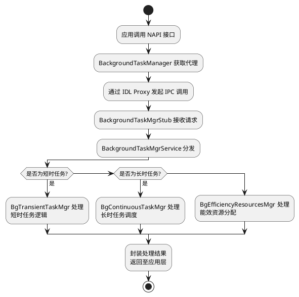
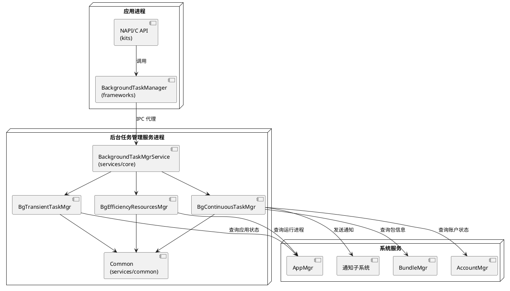
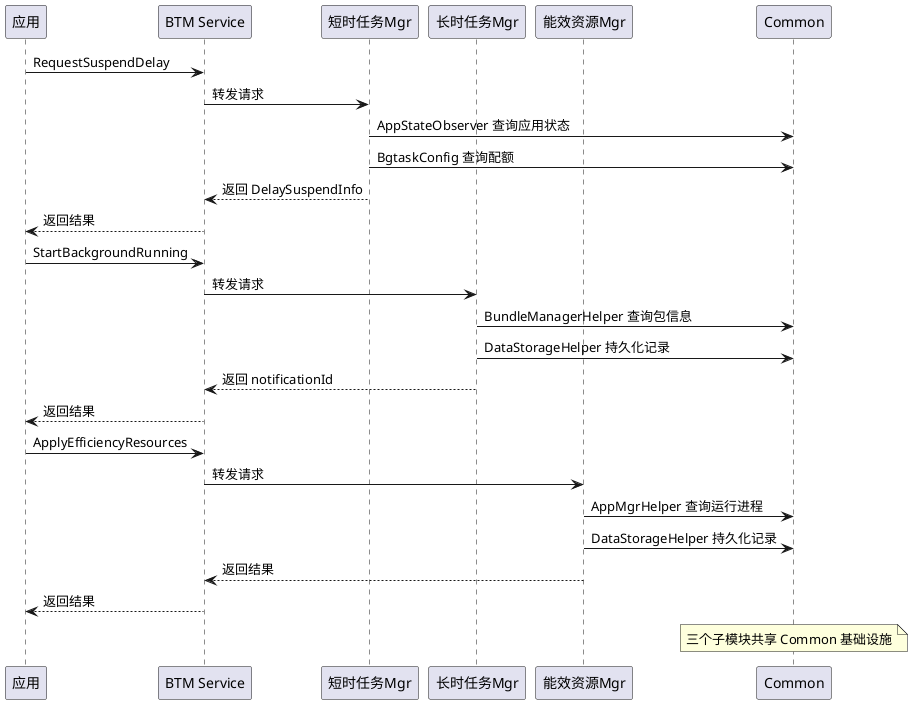
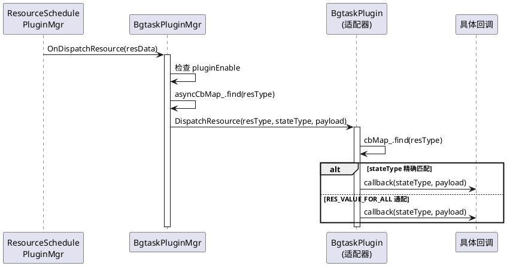
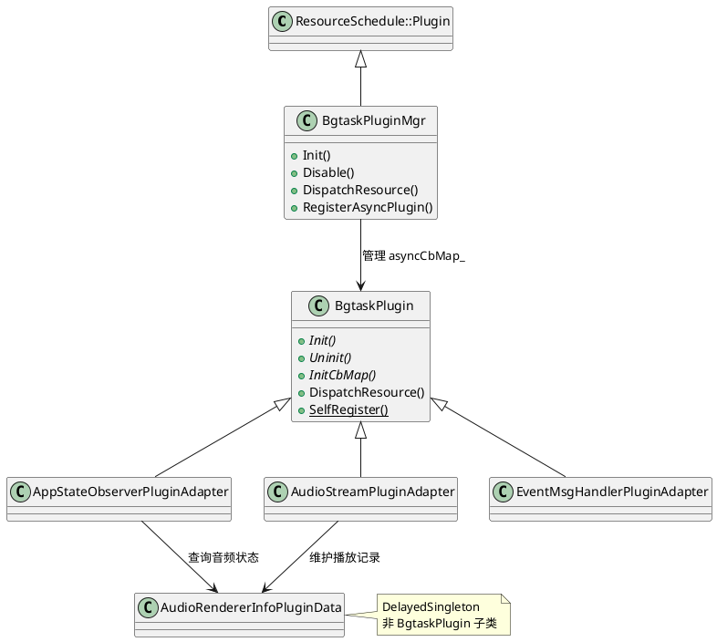
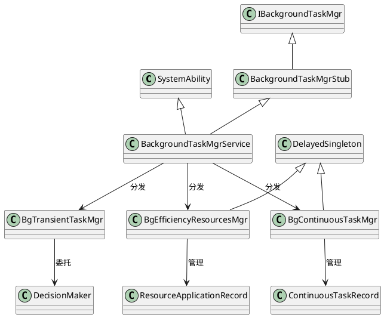

# 公共框架代码设计

> 文档版本：v1.0
> 更新时间：2026-08-19

## 上下文与场景

### IPC 调用链

从应用调用到服务端处理的完整 IPC 调用链路：

```
应用 ArkTS/JS 代码
    → NAPI 模块 (kits/napi/) 将 JS 调用转为 C++ 调用
    → BackgroundTaskManager (frameworks/) 获取服务代理
    → IBackgroundTaskMgr 代理 (IDL 自动生成的 Proxy 类)
    → IPC 跨进程调用
    → BackgroundTaskMgrStub (IDL 自动生成的 Stub 类)
    → BackgroundTaskMgrService (services/core/) 分发到子模块
    → BgTransientTaskMgr / BgContinuousTaskMgr / BgEfficiencyResourcesMgr
```

IDL 接口文件 `interfaces/innerkits/IBackgroundTaskMgr.idl` 定义了全部 IPC 方法。框架层通过 `BackgroundTaskMgrHelper` 获取服务代理。



## 部署拓扑



## 知识关联

### 三子模块交互关系

三个子模块通过 `BackgroundTaskMgrService` 统一分发，共享 `services/common/` 中的公共基础设施。

**共享基础设施**：
- `DataStorageHelper`：长时任务记录和能效资源记录均通过该类持久化到 JSON 文件
- `AppStateObserver`：短时任务和长时任务均监听应用状态变化
- `BundleManagerHelper`：长时任务和能效资源均查询包信息
- `BgtaskConfig`：三个子模块共享配置管理
- `ReportHiSysEventData`：三个子模块均通过该类上报 HiSysEvent

**订阅者联动**：
- `IBackgroundTaskSubscriber` 是统一的订阅者接口，三个子模块均支持订阅
- 应用可通过 `SubscribeBackgroundTask` 同时监听三类任务的状态变更

**数据流交叉点**：
- 长时任务取消时，可能触发能效资源中 CPU 资源的清理
- 短时任务超时取消时，通知订阅者任务结束
- 应用死亡时，`AppStateObserver` 通知三个子模块清理各自记录



## 演进与版本

总体架构随版本演进的主要变更：

- 三层架构（接口层/框架层/服务层）自初版即确立，保持稳定
- SA 注册机制通过 `SystemAbility` 基类支持，`ServiceReadyState` 就绪状态管理为后续多子模块并行初始化而引入
- 公共基础设施 `services/common/` 随子模块功能扩展持续新增工具类
- 类继承关系：`BackgroundTaskMgrService` 始终继承 `SystemAbility` + `BackgroundTaskMgrStub`，子模块管理器使用 `DelayedSingleton` 模式

## 代码与符号

### 公共基础设施索引

`services/common/` 模块提供后台任务管理服务的公共基础设施：

| 类名 | 头文件 | 职责 |
|------|--------|------|
| `AppStateObserver` | `services/common/include/app_state_observer.h` | 应用状态观察者，监听应用前后台切换、进程创建/死亡、Ability 状态变化 |
| `SystemEventObserver` | `services/common/include/system_event_observer.h` | 系统事件观察者，监听用户状态变更、Bundle 信息变更、系统公共事件 |
| `BundleManagerHelper` | `services/common/include/bundle_manager_helper.h` | BMS接口封装，获取包信息、检查权限声明、判断系统应用身份 |
| `AppMgrHelper` | `services/common/include/app_mgr_helper.h` | AMS接口封装，获取运行进程列表、订阅应用状态观察者、查询 Ability 状态 |
| `BgtaskConfig` | `services/common/include/bgtask_config.h` | 配置管理器，解析配置文件（豁免应用列表、恶意应用黑名单、配额参数等） |
| `DataStorageHelper` | `services/common/include/data_storage_helper.h` | 数据持久化能力封装，负责任务记录的 JSON 序列化存储和设备重启恢复 |
| `CommonUtils` | `services/common/include/common_utils.h` | 通用工具函数，JSON 校验、后台模式检查、字符串处理 |
| `TimeProvider` | `services/common/include/time_provider.h` | 时间获取能力封装，多种时钟类型的精确时间获取 |
| `ReportHiSysEventData` | `services/common/include/report_hisysevent_data.h` | HiSysEvent 上报数据结构 |
| `BgtaskHiTraceChain` | `services/common/include/bgtask_hitrace_chain.h` | HiTrace 链路追踪 |

### 插件能力

`services/plugin/` 模块提供后台任务管理服务的插件化事件接收能力。插件管理器 `BgtaskPluginMgr` 继承自 `ResourceSchedule::Plugin`，通过资源调度子系统 `PluginMgr` 的 C API（`OnPluginInit` / `OnPluginDisable` / `OnDispatchResource`）接收系统资源事件，分发给已注册的插件适配器处理。

**插件类一览**：

| 类名　　　　　　　　　　　　　　| 头文件　　　　　　　　　　　　　　　　　　　　　　　　　　　　| 职责　　　　　　　　　　　　　　　　　　　　　　　　　　　　　　　　　　　　　　　　　　　　　　　　　　　　　　　　　　　　　　　　　　　　　　　　　 |
| ---------------------------------| ---------------------------------------------------------------| --------------------------------------------------------------------------------------------------------------------------------------------------------|
| `BgtaskPluginMgr`　　　　　　　 | `services/plugin/include/bgtask_plugin_mgr.h`　　　　　　　　 | 插件管理器，继承 `ResourceSchedule::Plugin` 单例，管理插件注册表 `asyncCbMap_`、生命周期（`Init` / `Disable`）和事件分发（`DispatchResource`）　　　　 |
| `BgtaskPlugin`　　　　　　　　　| `services/plugin/include/bgtask_plugin.h`　　　　　　　　　　 | 插件抽象基类，定义 `Init` / `Uninit` / `InitCbMap` 接口，维护回调映射表 `cbMap_`（resType → stateType → callback），子类通过 `SelfRegister` 静态自注册 |
| `AppStateObserverPluginAdapter` | `services/plugin/include/app_state_observer_plugin_adapter.h` | 应用状态事件插件适配器，处理进程创建/死亡、应用前后台切换、Ability 状态变化、应用缓存状态变更，桥接到 `AppStateObserver` 和 `DecisionMaker`　　　　　　|
| `AudioStreamPluginAdapter`　　　| `services/plugin/include/audio_stream_plugin_adapter.h`　　　 | 音频流事件插件适配器，处理音频渲染状态变化（`RES_TYPE_AUDIO_RENDER_STATE_CHANGE`），维护 `AudioRendererInfoPluginData` 中的音频播放记录　　　　　　　　|
| `EventMsgHandlerPluginAdapter`　| `services/plugin/include/event_msg_handler_plugin_adapter.h`　| 事件消息处理插件适配器，处理观察者管理器状态变更和云配置更新事件　　　　　　　　　　　　　　　　　　　　　　　　　　　　　　　　　　　　　　　　　　　 |
| `AudioRendererInfoPluginData`　 | `services/plugin/include/audio_renderer_info_plugin_data.h`　 | 音频播放信息数据持有者（非插件），维护 `AudioInfo` 列表，提供 `CheckAppIsPlaying` 查询，供长时任务管理器校验音频播放状态　　　　　　　　　　　　　　　 |

**插件生命周期**：

1. **静态自注册**：各插件适配器通过文件级静态变量调用 `SelfRegister()`，在 `InitCbMap` 初始化回调表后调用 `BgtaskPluginMgr::RegisterAsyncPlugin(resType, plugin)` 注册到 `asyncCbMap_`
2. **服务初始化**：`BackgroundTaskMgrService::Init()` 调用 `BgtaskPluginMgr::GetInstance().Init()`，遍历 `asyncCbMap_` 调用各插件 `Init()` 并通过 `PluginMgr` 订阅资源类型，设置 `pluginEnable = true`
3. **事件分发**：资源调度 `PluginMgr` 通过 `OnDispatchResource(resData)` 回调，`BgtaskPluginMgr` 按 `resData->resType` 查找 `asyncCbMap_`，调用对应插件的 `DispatchResource(resType, stateType, payload)`，插件再按 `cbMap_` 中的 stateType 分发到具体回调
4. **禁用**：`BgtaskPluginMgr::Disable()` 设置 `pluginEnable = false`，取消资源订阅并调用各插件 `Uninit()`

**事件分发流程**：



**插件类继承关系**：



## 类继承关系


