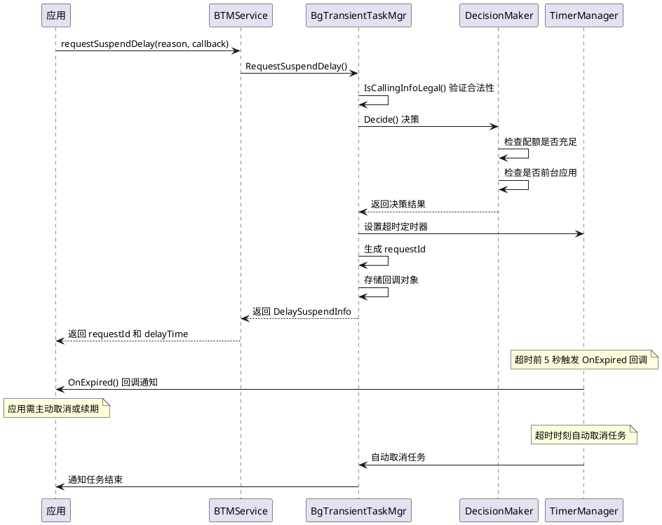
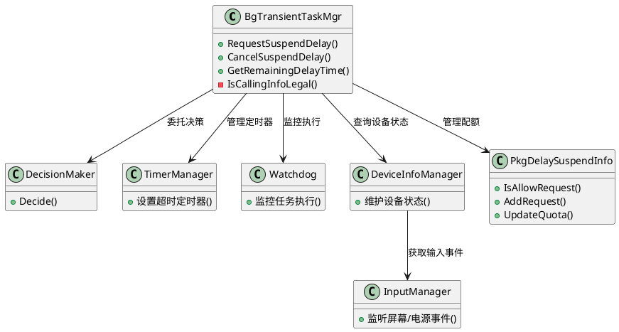

# 短时任务代码设计

> 文档版本：v1.0
> 更新时间：2026-08-19

## 上下文与场景

### 触发时机

- 应用在前台时申请
- 应用退到后台后、被挂起之前申请（默认 6~12 秒窗口期）

### 参与角色

| 角色　　　　　　 | 职责　　　　　　　　　　　　　　　　　　　　　　　　　　　　　　　　　　　　　　　|
| ------------------| -----------------------------------------------------------------------------------|
| 应用　　　　　　 | 调用 `requestSuspendDelay` 申请延迟挂起，任务完成后调用 `cancelSuspendDelay` 取消 |
| 后台任务管理服务 | 验证调用合法性、决策是否允许、管理配额和定时器　　　　　　　　　　　　　　　　　　|
| DecisionMaker　　| 判断配额是否充足、检查应用是否在前台　　　　　　　　　　　　　　　　　　　　　　　|
| TimerManager　　 | 管理超时定时器，提前 5 秒回调通知　　　　　　　　　　　　　　　　　　　　　　　　 |
| 订阅者　　　　　 | 通过 `IBackgroundTaskSubscriber` 监听任务状态变更　　　　　　　　　　　　　　　　 |

### 运行时序

## 知识关联

### 依赖的公共模块类

| 公共类 | 头文件 | 关联说明 |
|--------|--------|---------|
| `AppStateObserver` | `services/common/include/app_state_observer.h` | 监听应用前后台状态变化，影响计时暂停/恢复 |
| `BgtaskConfig` | `services/common/include/bgtask_config.h` | 提供配额参数和豁免应用列表配置 |
| `BundleManagerHelper` | `services/common/include/bundle_manager_helper.h` | 通过 UID 获取 Bundle 名称 |
| `AppMgrHelper` | `services/common/include/app_mgr_helper.h` | 查询应用运行状态 |
| `ReportHiSysEventData` | `services/common/include/report_hisysevent_data.h` | 上报任务申请/取消/超时事件 |

### 交互的外部系统服务

| 外部服务 | 交互方式 |
|---------|---------|
| 应用管理服务（AppMgr） | 查询应用前后台状态、进程信息 |
| 电源管理服务 | 监听屏幕亮灭、电源连接/断开（通过 `DeviceInfoManager`） |

### 跨子模块关联

- 短时任务超时取消后通知订阅者，与长时任务共享 `IBackgroundTaskSubscriber` 订阅者列表
- 应用死亡时 `AppStateObserver` 通知短时任务管理器清理记录，同时通知长时任务和能效资源管理器

## 演进与版本

### 接口演进

- 短时任务 API 自 OpenHarmony 初版即提供，接口稳定
- 新增 `PauseTransientTaskTimeForInner` / `StartTransientTaskTimeForInner` 内部接口支持暂停/恢复计时
- 新增 `OnAppCacheStateChanged` 支持应用缓存状态变更通知
- API20版本新增支持获取应用自身的所有短时任务信息（`getTransientTaskInfo`）

## 数据模型

### DelaySuspendInfo

短时任务申请返回信息，定义于 `interfaces/innerkits/include/delay_suspend_info.h`：

| 字段 | 类型 | 说明 |
|------|------|------|
| `requestId_` | `int32_t` | 请求 ID，默认 -1 |
| `actualDelayTime_` | `int32_t` | 实际延迟时间（秒），默认 0 |

### TransientTaskAppInfo

短时任务应用信息，定义于 `interfaces/innerkits/include/transient_task_app_info.h`：

| 字段 | 类型 | 说明 |
|------|------|------|
| `packageName_` | `std::string` | 包名 |
| `uid_` | `int32_t` | 用户 ID |
| `pid_` | `int32_t` | 进程 ID，默认 -1 |

### KeyInfo

任务键信息（内部使用），定义于 `services/transient_task/include/key_info.h`：

| 字段 | 类型 | 说明 |
|------|------|------|
| `pkg_` | `std::string` | 包名，默认 "" |
| `uid_` | `int32_t` | 用户 ID，默认 -1 |
| `pid_` | `int32_t` | 进程 ID，默认 -1 |

### PkgDelaySuspendInfo

包延迟挂起信息（内部使用），定义于 `services/transient_task/include/pkg_delay_suspend_info.h`：

| 字段 | 类型 | 说明 |
|------|------|------|
| `pkg_` | `std::string` | 包名 |
| `uid_` | `int32_t` | 用户 ID |
| `quota_` | `int32_t` | 剩余配额，初始值 INIT_QUOTA |
| `spendTime_` | `int32_t` | 已消耗时长 |
| `baseTime_` | `int32_t` | 基准时间 |
| `isCounting_` | `bool` | 是否正在计时 |
| `requestList_` | `DelaySuspendInfoEx 列表` | 请求列表 |

## 代码与符号

### 核心类

| 类名　　　　　　　　　| 职责　　　　　　　　　　　　　　　　|
| -----------------------| -------------------------------------|
| `BgTransientTaskMgr`　| 短时任务主管理器，协调各子模块　　　|
| `DecisionMaker`　　　 | 决策器，判断是否允许申请任务　　　　|
| `TimerManager`　　　　| 定时器管理，控制任务超时　　　　　　|
| `Watchdog`　　　　　　| 看门狗，监控任务执行状态　　　　　　|
| `DeviceInfoManager`　 | 设备信息管理，维护屏幕/电源状态　　 |
| `InputManager`　　　　| 输入事件管理，监听屏幕亮灭/电源连接 |
| `KeyInfo`　　　　　　 | 任务键信息　　　　　　　　　　　　　|
| `PkgDelaySuspendInfo` | 包延迟挂起信息　　　　　　　　　　　|

### 事件类型

`TransientTaskEventType` 枚举（定义于 `bg_transient_task_mgr.h`）：

| 枚举值 | 说明 |
|--------|------|
| `TASK_START` | 任务开始 |
| `TASK_END` | 任务结束 |
| `TASK_ERR` | 任务错误 |
| `APP_TASK_START` | 应用任务开始 |
| `APP_TASK_END` | 应用任务结束 |

### 类继承调用关系

## 关键数据标记

短时任务的实现依赖一组关键数据标记与字段来管理配额、计时与请求标识。这些标记在不同 API 版本下行为存在差异，是短时任务运行时决策的核心依据。

### 标记位与字段定义

| 标记/字段 | 所在位置 | 类型 | 含义 |
|----------|---------|------|------|
| `INIT_QUOTA` | `services/transient_task/include/bg_transient_task_mgr.h` | 常量 | 初始配额常量，作为应用首次申请短时任务时的默认剩余配额基准值 |
| `requestId` | `DelaySuspendInfo` / `BgTransientTaskMgr` | `int32_t` | 每次申请 `RequestSuspendDelay` 分配的唯一标识，用于后续 `CancelSuspendDelay` / `GetRemainingDelayTime` 关联同一任务 |
| `actualDelayTime_` | `DelaySuspendInfo` | `int32_t` | 实际延迟时间（毫秒），返回给应用的有效窗口长度，受配额与最大允许时长共同约束 |
| `quota_` | `PkgDelaySuspendInfo` | `int32_t` | 剩余配额（毫秒），按包名维度统计的可用短时任务时长，每次申请与超时均会扣减 |
| `spendTime_` | `PkgDelaySuspendInfo` | `int32_t` | 已消耗时长（毫秒），记录该包已使用的短时任务总时长，用于配额上限判定 |
| `isCounting_` | `PkgDelaySuspendInfo` | `bool` | 是否正在计时，标记当前包是否已有活跃短时任务正在倒计时，避免重复启动定时器 |

### API 版本间差异表现

| 标记/字段 | API20 之前 | API20 及之后 | 差异说明 |
|----------|-----------|-------------|---------|
| `INIT_QUOTA` | 作为初始配额基准 | 行为一致 | 各版本保持稳定，作为配额扣减的起点 |
| `requestId` | 单调递增分配 | 单调递增分配 | 行为一致，唯一标识每次申请 |
| `actualDelayTime_` | 由配额与最大时长取较小值 | 由配额与最大时长取较小值 | 行为一致 |
| `quota_` | 仅通过 `RequestSuspendDelay` / `CancelSuspendDelay` / 超时扣减 | 扣减逻辑不变；`getTransientTaskInfo` 可读取剩余配额 | API20 新增查询接口暴露该值 |
| `spendTime_` | 仅内部使用 | 可通过 `getTransientTaskInfo` 间接反映 | API20 新增查询能力 |
| `isCounting_` | 控制单包定时器启停 | 行为一致；配合内部暂停接口变更 | 见下方内部接口差异 |

### `getTransientTaskInfo` 接口的差异表现（API20）

API20 之前应用只能通过 `requestSuspendDelay` 返回的 `DelaySuspendInfo` 获取单次任务的 `requestId` 与 `actualDelayTime`，无法查询自身已申请的全部短时任务列表。API20 新增 `getTransientTaskInfo` 接口后：

- 应用可一次性获取自身名下所有活跃短时任务的 `requestId`、`actualDelayTime` 等信息
- 同时返回包维度剩余配额（对应 `quota_`），便于应用判断是否还能继续申请
- 该接口为只读查询，不触发配额扣减，不影响 `isCounting_` 状态
- 与 `GetAllTransientTasks` 内部接口的区别：`GetAllTransientTasks` 由系统服务调用查询全局任务，`getTransientTaskInfo` 面向应用自身且受调用者身份过滤

### `PauseTransientTaskTimeForInner` / `StartTransientTaskTimeForInner` 内部接口差异

这两个内部接口用于系统服务在特殊场景下暂停/恢复短时任务计时，对应 `isCounting_` 与定时器状态切换：

| 接口 | 触发场景 | 对 `isCounting_` 的影响 | 对 `quota_` / `spendTime_` 的影响 |
|------|---------|------------------------|--------------------------------|
| `PauseTransientTaskTimeForInner(uid)` | 系统判定需暂停某应用计时（如进入特殊管控态） | 置为 `false`，停止 `TimerManager` 倒计时 | 暂停期间不扣减 `quota_`，不累加 `spendTime_` |
| `StartTransientTaskTimeForInner(uid)` | 暂停条件解除，恢复计时 | 置为 `true`，基于剩余时长重启定时器 | 恢复后继续扣减 `quota_`，累加 `spendTime_` |

差异要点：

- 暂停/恢复是配额中性的：暂停不释放配额，恢复不重新分配配额，仅在时间维度上"冻结"与"解冻"
- 与正常超时路径互斥：处于暂停态时，`TimerManager` 不会触发 `OnExpired` 回调；恢复后按剩余 `actualDelayTime_` 继续计时
- 这两个接口为内部 API，不对第三方应用开放，仅由系统服务通过 `IBackgroundTaskMgr` 内部通道调用
- 配合 `OnAppCacheStateChanged` 等回调，支持应用缓存状态变化时联动调整计时行为

## DFX 实现设计

短时任务模块各 DFX 维度的关键代码实现要点，对应 `docs/spec/transient_task.md` 的 DFX 设计规格。

### 可靠性实现

- 错误码：`bgtaskmgr_inner_errors.h` 定义 `9900001`~`9900004` 段，`bgtaskmgr_inner_errors.cpp` 维护码到消息映射
- 内存态：`BgTransientTaskMgr::keyInfoMap_`、`DecisionMaker::pkgDelaySuspendInfoMap_` 纯内存，无 `DataStorageHelper` 落盘接口
- 超时+看门狗：`TimerManager`（继承 `EventHandler`）投递定时器；`Watchdog` 宽限 `WATCHDOG_DELAY_TIME` 后 `ForceCancelSuspendDelay`
- 就绪门控：`std::atomic<bool> isReady_`，`InitNecessaryState` 轮询依赖服务（`SERVICE_WAIT_TIME` 间隔）
- 死亡恢复：`ExpiredCallbackDeathRecipient`/`SubscriberDeathRecipient`/`HandleSuspendManagerDie`

### 安全性实现

- Atomic Service 拦截：`BackgroundTaskMgrService::CheckAtomicService` 经 `AccessTokenKit::IsAtomicServiceByFullTokenID`
- innerAPI 调用者限制：`BgTransientTaskMgr::CheckProcessName`（`WEAK_FUNC`）校验 `SUSPEND_NATIVE_OPERATE_CALLER` 白名单
- Token 校验：`BackgroundTaskMgrService::CheckCallingToken` 限 `TOKEN_NATIVE`/`TOKEN_SHELL`
- 豁免签名校验：`BgtaskConfig::CheckSignature`（`WEAK_FUNC`）调 `ResSchedSignatureValidator`
- Dump 权限：`BackgroundTaskMgrService::AllowDump`（ENG 模式 + `ohos.permission.DUMP`）

### 可扩展实现

- 订阅者：`subscriberList_` + `NotifyTransientTaskSuscriber` 按 `TransientTaskEventType` 分发
- 无插件：无 `dlopen`，无多用户（`KeyInfo` 仅 pkg/uid/pid）

### 可配置实现

- 系统属性：`bgtask_common.cpp` 经 `system::GetParameter` 读取 `persist.sys.bgtask_*`
- 配置文件：`BgtaskConfig::LoadConfigFile` 解析 `suspend_manager_config.json`
- 云配置：`SetBgTaskConfig` IPC → `BgtaskConfig::AddExemptedQuatoData`
- 硬编码：`MAX_REQUEST_ID=3`、`MIN_ALLOW_QUOTA_TIME`、`WATCHDOG_DELAY_TIME`

### 可维护实现

- 日志：`bgtaskmgr_log_wrapper.h` 的 `BGTASK_LOG*`，`transient_task_log.h` 覆盖 LOG_TAG 为 `TRANSIENT_TASK`
- HiSysevent：`DecisionMaker::Decide`/`RemoveRequest` 写 `TRANSIENT_TASK_APPLY`/`CANCEL`
- Dump：`BgTransientTaskMgr::ShellDump` 子命令（`All`/`BATTARY_LOW`/`PAUSE` 等）
- HiTrace：`HitraceScoped` 标注关键入口
