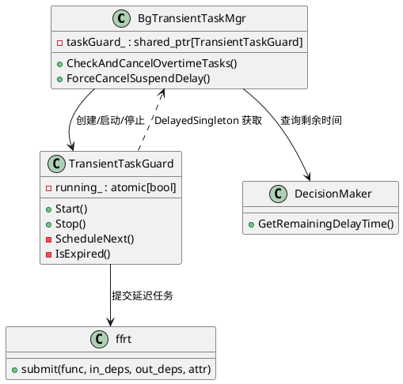
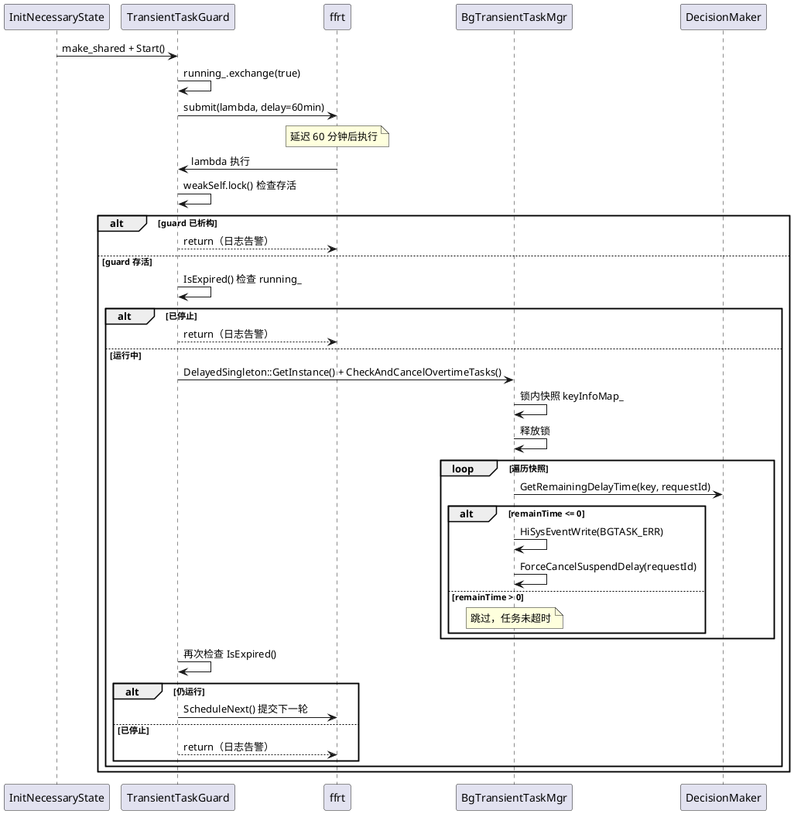

# 短时任务守卫线程设计

> 文档版本：v1.0
> 更新时间：2026-09-11

## 1. 背景与定位

短时任务超时处理原有两级机制均依赖系统事件循环（`EventHandler`）：

- **第一级——定时器**：`TimerManager`（继承 `EventHandler`）投递定时器，提前回调通知应用
- **第二级——看门狗**：`Watchdog`（继承 `EventHandler`）宽限 `WATCHDOG_DELAY_TIME`（6 秒）后 `ForceCancelSuspendDelay`

当事件循环阻塞或异常时，两级机制可能同时失效，导致超时任务不被清理、应用长期占用后台配额。

**守卫线程 `TransientTaskGuard`** 作为第三级兜底机制，独立于事件循环，通过 ffrt 延迟任务周期性扫描全部活跃短时任务，对已超时但未被清理的任务执行强制取消。

## 2. 整体架构



**引用关系设计：**

- `BgTransientTaskMgr` 持有 `shared_ptr<TransientTaskGuard>`（强引用，控制生命周期）
- `TransientTaskGuard` 通过 `DelayedSingleton<BgTransientTaskMgr>::GetInstance()` 获取管理器（无成员引用，不构成循环）
- ffrt 延迟任务以 `weak_ptr<TransientTaskGuard>` 捕获 guard 自身（不阻止析构）

引用链无环：`BgTransientTaskMgr →(strong)→ TransientTaskGuard`，guard 反向通过单例获取管理器，不持有引用。

## 3. 核心类

### 3.1 TransientTaskGuard

定义于 `services/transient_task/include/transient_task_guard.h`，继承 `std::enable_shared_from_this<TransientTaskGuard>` 以支持在异步任务中安全获取自身 `shared_ptr`。

**成员变量：**

| 成员 | 类型 | 初始值 | 说明 |
|------|------|--------|------|
| `running_` | `atomic<bool>` | `false` | 运行标志，`Start` 时 `exchange(true)` 保证幂等，`Stop` 时 `store(false)` |

**方法：**

| 方法 | 签名 | 说明 |
|------|------|------|
| 构造 | `TransientTaskGuard() = default` | 默认构造，无参数 |
| 析构 | `~TransientTaskGuard()` | 调用 `Stop()`，保证幂等 |
| `Start` | `void Start()` | 启动守卫线程。`exchange(true)` 保证幂等；未在运行时调用 `ScheduleNext` |
| `Stop` | `void Stop()` | 停止守卫线程。置 `running_=false`，使已排队任务到期后不重调度 |
| `ScheduleNext` | `void ScheduleNext()` | 提交 60 分钟延迟 ffrt 任务，任务体以 `weak_ptr` 捕获自身，到期后检查存活与运行状态，通过后执行扫描并递归提交下一轮 |
| `IsExpired` | `bool IsExpired() const` | 返回 `!running_.load()`，用于延迟任务到期时判断是否应退出 |

### 3.2 BgTransientTaskMgr 新增成员

| 成员/方法 | 所在文件 | 类型/签名 | 说明 |
|-----------|---------|-----------|------|
| `taskGuard_` | `bg_transient_task_mgr.h` | `shared_ptr<TransientTaskGuard>` | 守卫线程实例 |
| `CheckAndCancelOvertimeTasks` | `bg_transient_task_mgr.h` | `void CheckAndCancelOvertimeTasks()` | 守卫线程周期调用的扫描入口 |

## 4. 核心方法

### 4.1 Start

```
Start()
├── running_.exchange(true) 返回旧值
│   ├── 旧值为 true → 已在运行，日志告警，return
│   └── 旧值为 false → 未在运行，继续
└── ScheduleNext()
```

**幂等保证：** `exchange(true)` 原子操作，返回旧值。若旧值为 `true` 说明已在运行，直接返回；只有旧值为 `false`（未在运行）才继续。保证不会产生多条并发任务链。

### 4.2 ScheduleNext

```
ScheduleNext()
├── weakSelf = shared_from_this()  →  weak_ptr 捕获
├── ffrt::submit(lambda, {}, {}, delay=GUARD_INTERVAL_US)
│   └── [60 分钟后执行]
│       ├── weakSelf.lock()
│       │   └── nullptr → 对象已析构，日志告警，return
│       ├── IsExpired()  →  !running_.load()
│       │   └── true → 已停止，日志告警，return
│       ├── DelayedSingleton<BgTransientTaskMgr>::GetInstance()
│       │   └── nullptr → 管理器为空，日志告警，return
│       ├── mgr->CheckAndCancelOvertimeTasks()
│       ├── IsExpired()  →  !running_.load()
│       │   └── true → 扫描期间被停止，日志告警，return
│       └── ScheduleNext()  →  递归提交下一轮
└── 返回（不阻塞）
```

**设计要点：**

| 要点 | 说明 |
|------|------|
| `weak_ptr` 捕获 | lambda 不强引用守卫对象，对象可随 `BgTransientTaskMgr` 析构（`shared_ptr` 自动释放）正常析构，避免对象永生 |
| 双重检查 | 执行 `CheckAndCancelOvertimeTasks` 前后各检查一次 `running_`，覆盖扫描期间被 `Stop` 的时序窗口 |
| 异常分支全日志 | 4 个退出分支均输出 `BGTASK_LOGE`，携带 `running` 供问题定位 |
| ffrt 参数 | `submit(func, {}, {}, attr)`，第 2/3 参数为空依赖向量表示独立任务不参与数据流调度，第 4 参数 `task_attr().delay(GUARD_INTERVAL_US)` 指定 60 分钟延迟 |

### 4.3 Stop

```
Stop()
└── running_.store(false)  →  使旧链任务到期后 running_==false 而退出
```

**幂等性：** 重复 `Stop()` 无副作用——`store(false)` 幂等。

### 4.4 CheckAndCancelOvertimeTasks

定义于 `services/transient_task/src/bg_transient_task_mgr.cpp:440`，由守卫线程周期调用：

1. 在 `expiredCallbackLock_` 保护下快照 `keyInfoMap_` 到局部 `tasks` 向量，随后释放锁
2. 遍历快照，对每个任务调用 `DecisionMaker::GetRemainingDelayTime(key, requestId)` 获取剩余时间
3. 剩余时间 `<= 0` 的任务通过 `HiSysEventWrite` 上报 `BGTASK_ERR` 打点（携带 APP_UID、APP_PID、APP_NAME、MODULE_NAME、FUNC_NAME、ERR_CODE=remainTime、ERR_MSG），随后调用 `ForceCancelSuspendDelay(requestId)` 强制取消
4. 快照后释放锁避免持锁调用 `ForceCancelSuspendDelay`（该方法内部也会加 `expiredCallbackLock_`）

## 5. 运行时序



## 6. 生命周期管理

守卫线程随 `BgTransientTaskMgr` 的生命周期管理：

| 阶段 | 触发位置 | 代码位置 | 行为 |
|------|---------|---------|------|
| 创建+启动 | `BgTransientTaskMgr::InitNecessaryState` | `bg_transient_task_mgr.cpp:133-134` | `make_shared<TransientTaskGuard>()` + `Start()`，在 `isReady_=true` 和 `SetReady` 之后启动 |
| 停止 | `BgTransientTaskMgr::~BgTransientTaskMgr` | `bg_transient_task_mgr.cpp:75-80` | 显式 `taskGuard_->Stop()`，`shared_ptr` 随析构自动释放 |
| 析构 | `TransientTaskGuard::~TransientTaskGuard` | `transient_task_guard.cpp:31-34` | 调用 `Stop()`，幂等 |
| 延迟任务释放 | ffrt 延迟任务到期 | `transient_task_guard.cpp:50-53` | `weakSelf.lock()` 返回 `nullptr` 时直接 return；不持有对象引用，对象可正常析构 |

**生命周期安全保障：**

- guard 不持有 `BgTransientTaskMgr` 的引用，通过 `DelayedSingleton<BgTransientTaskMgr>::GetInstance()` 获取，不构成循环引用
- lambda 以 `weak_ptr` 捕获 guard 自身，不阻止对象析构
- `Stop()` 后已排队任务无法取消，但到期后通过 `running_==false` 安全退出

## 7. 关键数据标记

| 标记/字段 | 所在位置 | 类型 | 含义 |
|----------|---------|------|------|
| `GUARD_INTERVAL_US` | `transient_task_guard.cpp:27` | `constexpr int64_t` | 守卫线程检查间隔，60 分钟（`60LL * 60 * USEC_PER_SEC = 3,600,000,000 µs`） |
| `running_` | `TransientTaskGuard` | `atomic<bool>` | 运行标志，`Start` 时 `exchange(true)`，`Stop` 时 `store(false)`，初始 `false` |
| `taskGuard_` | `BgTransientTaskMgr` | `shared_ptr<TransientTaskGuard>` | 守卫线程实例，`InitNecessaryState` 创建，析构时 Stop |
| `USEC_PER_SEC` | `time_provider.h` | `int64_t` | 微秒/秒常量，值 `1000000LL`，用于 `GUARD_INTERVAL_US` 计算 |

## 8. 涉及文件清单

| 文件 | 变更类型 | 说明 |
|------|---------|------|
| `services/transient_task/include/transient_task_guard.h` | 新增 | `TransientTaskGuard` 类声明 |
| `services/transient_task/src/transient_task_guard.cpp` | 新增 | `TransientTaskGuard` 实现（89 行） |
| `services/transient_task/include/bg_transient_task_mgr.h` | 修改 | 新增 `#include "transient_task_guard.h"`、`CheckAndCancelOvertimeTasks()` 方法声明、`taskGuard_` 成员 |
| `services/transient_task/src/bg_transient_task_mgr.cpp` | 修改 | 析构 Stop、`InitNecessaryState` 创建启动守卫、`CheckAndCancelOvertimeTasks` 实现 |
| `services/BUILD.gn` | 修改 | 新增 `transient_task_guard.cpp` 到编译源列表 |
| `services/test/unittest/BUILD.gn` | 修改 | 5 个测试目标新增 `ffrt:libffrt` 依赖 |
| `services/test/unittest/bg_transient_task_mgr_test.cpp` | 修改 | 新增 5 个测试用例 |

## 9. 测试覆盖

| 测试用例 | 验证内容 |
|---------|---------|
| `TransientTaskGuard_001` | Start/Stop 基本生命周期，`running_` 状态切换 |
| `TransientTaskGuard_002` | 重复 Start 幂等，不产生多链 |
| `CheckAndCancelOvertimeTasks_001` | 空 `keyInfoMap` 下不崩溃 |
| `CheckAndCancelOvertimeTasks_002` | 未超时任务（`delayTime=MSEC_PER_MIN`）不被取消 |
| `CheckAndCancelOvertimeTasks_003` | 已超时任务（`delayTime=0`）被强制取消，`keyInfoMap` 清空 |
