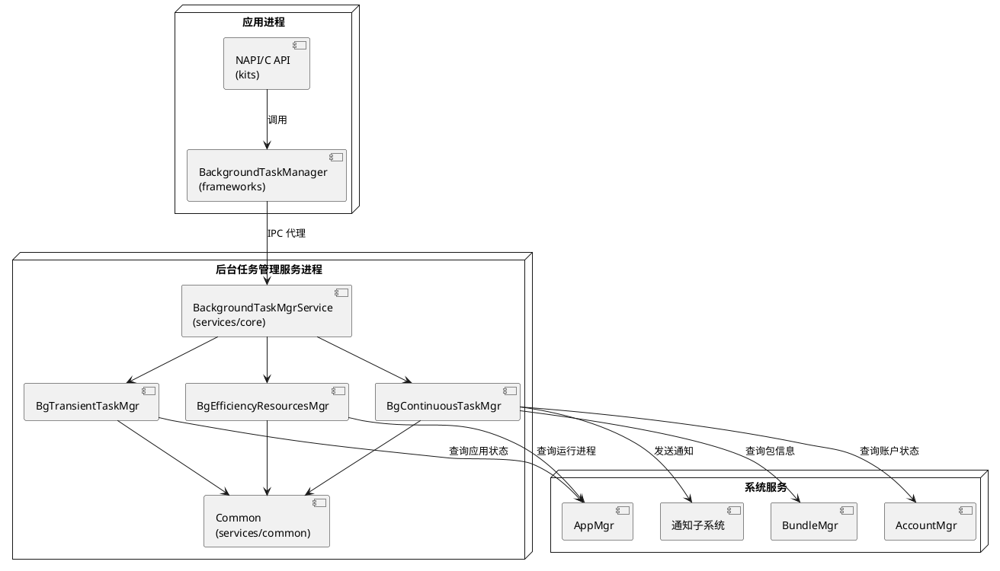

# 架构原则

> 文档版本：v1.0
> 更新时间：2026-08-19
> 本文档阐述后台任务管理组件的架构原则，包括三层架构、SA 概念、分层职责规格、SA 注册与启动规格、目录结构、编译方式、构建特性开关、部署拓扑与公共基础设施索引。

## 三层架构

后台任务管理组件采用三层架构，自上而下为接口层、框架层、服务层：

| 层　　　　　　　　　 | 目录　　　　　　　　　　　　　　　　　　　　　　　　　　　　 | 职责　　　　　　　　　　　　　　　　　　　　　　　　　　　　　　　　　　　 |
| ----------------------| --------------------------------------------------------------| ----------------------------------------------------------------------------|
| 接口层（interfaces） | `interfaces/innerkits/` + `interfaces/kits/`　　　　　　　　 | 定义 IDL 接口和数据模型（innerkits），提供多语言外部 API（NAPI/C/CJ/ANI）　|
| 框架层（frameworks） | `frameworks/include/` + `frameworks/src/`　　　　　　　　　　| 客户端代理 `BackgroundTaskManager`，封装 IPC 调用，管理服务代理生命周期　　|
| 服务层（services）　 | `services/core/` + `services/{module}/` + `services/common/` | 服务端实现，包含核心服务入口 `BackgroundTaskMgrService` 和三个子模块管理器 |

## SA 概念

`BackgroundTaskMgrService` 是后台任务管理的系统服务入口，继承自 `SystemAbility` 基类，SA ID：由 `system_ability_definition.h` 定义。

源码位置：`services/core/include/background_task_mgr_service.h`

## 目录结构总览

```
background_task_mgr/
├── docs/                    # 知识库（本目录）
│   ├── knowledge/           # 基本概念与业务背景
│   ├── spec/               # 规格描述
│   └── design/             # 代码实现
├── frameworks/              # 框架层（客户端代理）
├── interfaces/             # 接口层（IDL/NAPI/C API）
├── services/                # 服务层（服务端实现）
│   ├── common/              # 公共基础设施
│   ├── transient_task/      # 短时任务服务
│   ├── continuous_task/     # 长时任务服务
│   ├── efficiency_resources/ # 能效资源服务
│   └── core/               # 核心服务入口
│   └── plugin/             # 插件框架接入分发
│   └── test/               # 测试用例
├── sa_profile/             # 系统能力配置
└── resources/              # 资源包
```

知识库 `docs/` 下按文档类型组织：

- `knowledge/`：业务术语表（`glossary.md`）、业务背景（`business_context.md`）、编码要求（`coding_standards.md`）、架构原则（`architecture.md`）
- `spec/`：短时任务规格（`transient_task.md`）、长时任务规格（`continuous_task.md`）、能效资源规格（`efficiency_resources.md`）
- `design/`：公共架构实现（`overview.md`）、短时任务实现（`transient_task.md`）、长时任务实现（`continuous_task.md`）、能效资源实现（`efficiency_resources.md`）

## 编译方式

### 组件信息

| 项目 | 值 |
|------|------|
| 组件名 | `background_task_mgr` |
| 子系统 | `resourceschedule` |
| 构建系统 | GN + Ninja |
| 构建配置 | `BUILD.gn`（根目录）、`bgtaskmgr.gni`（路径定义）、`bundle.json`（组件元数据） |

### 源码交付件构建

源码交付件分为框架层和服务层两个构建组：

| 构建 target | 说明 | 包含内容 |
|-------------|------|----------|
| `fwk_group_background_task_mgr_all` | 框架层构建组 | 接口层 IDL 接口和数据模型（`bgtaskmgr_interfaces`） |
| `service_group_background_task_mgr_all` | 服务层构建组 | 资源文件（`bgtaskmgr_resources`）、SA 配置（`bgtaskmgr_sa_profile`）、服务实现（`bgtaskmgr_service`） |

```bash
# 构建全量组件（框架 + 服务）
hb build --product-name {product_name} --build-target background_task_mgr

# 仅构建框架层
hb build --product-name {product_name} --build-target fwk_group_background_task_mgr_all

# 仅构建服务层
hb build --product-name {product_name} --build-target service_group_background_task_mgr_all
```

### 测试代码交付件构建

测试交付件通过 `test_background_task_mgr_all` 构建组统一管理：

| 测试类型　　　　 | 目录　　　　　　　　　　　　　　　　　　　　　　　　　　　　| 说明　　　　　　　　　　　　　　 |
| ------------------| -------------------------------------------------------------| ----------------------------------|
| 框架层UT　　　　 | `frameworks/test/unittest/`　　　　　　　　　　　　　　　　 | `unittest`　　　　　　　　　　　 |
| 接口层UT　　　　 | `interfaces/test/unittest/bgtask_manager_client_test/`　　　| `bgtask_client_unit_test`　　　　|
| 长时任务 JS 测试 | `interfaces/test/unittest/continuous_task_jsunittest/`　　　| `js_unittest`　　　　　　　　　　|
| 能效资源 JS 测试 | `interfaces/test/unittest/efficiency_resources_jsunittest/` | `js_unittest`　　　　　　　　　　|
| 短时任务 JS 测试 | `interfaces/test/unittest/transient_task_jsunittest/`　　　 | `js_unittest`　　　　　　　　　　|
| 服务层UT　　　　 | `services/test/unittest/bgtask_manager_abnormal_unit_test/` | 异常场景测试　　　　　　　　　　 |
| FUZZ用例　　　　 | `test/fuzztest/`　　　　　　　　　　　　　　　　　　　　　　| IPC 安全模糊测试（23 个 fuzzer） |
| 系统测试　　　　 | `test/systemtest/`　　　　　　　　　　　　　　　　　　　　　| Dump 功能系统测试　　　　　　　　|

```bash
# 构建全部测试
hb build --product-name {product_name} --build-target test_background_task_mgr_all

# 运行单元测试（需在设备上执行）
hdc file send {process_name} /data/local/tmp/
hdc shell
/data/local/tmp/bgtask_client_unit_test
```

## 构建特性开关

构建特性定义于 `bgtaskmgr.gni`，可在构建时通过 `gn args` 配置：

| 特性 | 默认值 | 说明 |
|------|--------|------|
| `background_task_mgr_graphics` | true | 图形界面支持 |
| `background_task_mgr_jsstack` | true | JS 调用栈支持 |
| `background_task_mgr_device_enable` | true | 设备使能开关（false 时跳过全部构建） |
| `background_task_mgr_notification_enable` | true | 通知功能支持 |

## 部署拓扑



## 公共基础设施索引

`services/common/` 模块提供后台任务管理服务的公共基础设施：

| 类名　　　　　　　　　 | 头文件　　　　　　　　　　　　　　　　　　　　　　 | 职责　　　　　　　　　　　　　　　　　　　　　　　　　　　　　　　　　　 |
| ------------------------| ----------------------------------------------------| --------------------------------------------------------------------------|
| `AppStateObserver`　　 | `services/common/include/app_state_observer.h`　　 | 应用状态观察者，从AMS监听应用前后台切换、进程创建/死亡、Ability 状态变化 |
| `SystemEventObserver`　| `services/common/include/system_event_observer.h`　| 公共事件观察者，监听用户状态变更、Bundle 信息变更、系统公共事件　　　　　|
| `BundleManagerHelper`　| `services/common/include/bundle_manager_helper.h`　| BMS接口封装，获取包信息、检查权限声明、判断系统应用身份　　　　　　　　　|
| `AppMgrHelper`　　　　 | `services/common/include/app_mgr_helper.h`　　　　 | AMS接口封装，获取运行进程列表、订阅应用状态观察者、查询 Ability 状态　　 |
| `BgtaskConfig`　　　　 | `services/common/include/bgtask_config.h`　　　　　| 配置管理器，解析配置文件（豁免应用列表、恶意应用黑名单、配额参数等）　　 |
| `DataStorageHelper`　　| `services/common/include/data_storage_helper.h`　　| 数据持久化能力封装，负责任务记录的 JSON 序列化存储和设备重启恢复　　　　 |
| `CommonUtils`　　　　　| `services/common/include/common_utils.h`　　　　　 | 通用工具函数，JSON 校验、后台模式检查、字符串处理　　　　　　　　　　　　|
| `TimeProvider`　　　　 | `services/common/include/time_provider.h`　　　　　| 时间获取能力封装，多种时钟类型的精确时间获取　　　　　　　　　　　　　　 |
| `ReportHiSysEventData` | `services/common/include/report_hisysevent_data.h` | HiSysEvent 上报数据结构　　　　　　　　　　　　　　　　　　　　　　　　　|
| `BgtaskHiTraceChain`　 | `services/common/include/bgtask_hitrace_chain.h`　 | HiTrace 链路追踪　　　　　　　　　　　　　　　　　　　　　　　　　　　　 |
