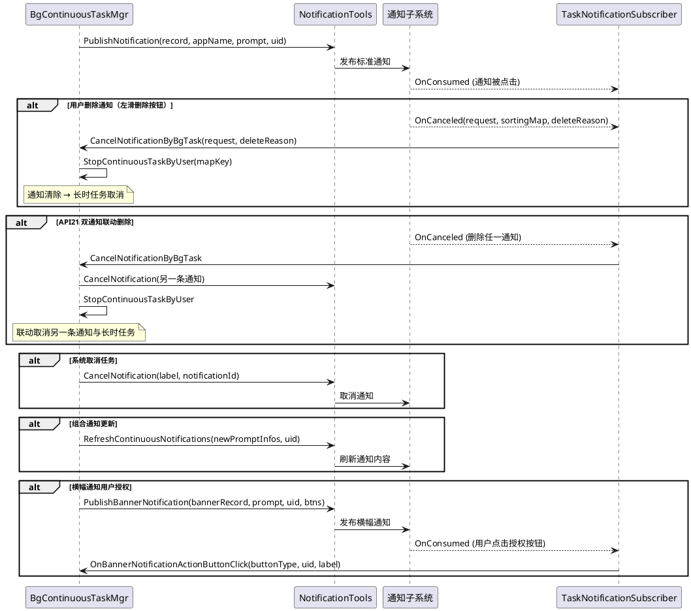
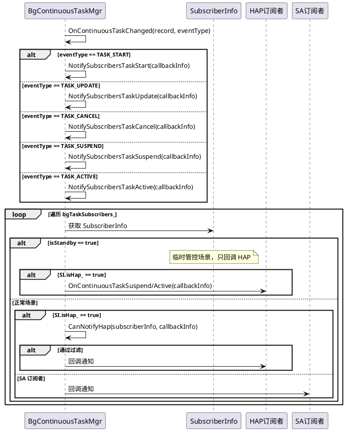

# 长时任务规格

> 文档版本：v1.0
> 更新时间：2026-08-19

## 实体概念

### 定义

长时任务（Continuous Task）是后台任务管理组件为用户可感知且需要持续在后台运行的业务提供的一种长期后台运行保障机制。应用通过指定后台模式申请长时任务后，系统强制在通知栏显示提示，保障业务在后台持续运行。

长时任务给用户能够直观感受到的且需要一直在后台运行的业务提供后台运行生命周期的保障。比如：业务需要在后台播放声音、需要在后台持续导航定位等。此类用户可以直观感知到的后台业务行为，可以通过使用长时任务对应的后台模式保障业务在后台的运行，支撑应用完成在后台的业务。

### 核心概念

| 概念　　　　　　　　　　　　　　　　 | 说明　　　　　　　　　　　　　　　　　　　　　　　 |
| --------------------------------------| ----------------------------------------------------|
| 长时任务类型（Background Task Mode） | 长时任务类型标识，如音频播放、定位导航、数据传输等 |
| 通知提示　　　　　　　　　　　　　　 | 申请长时任务后系统强制弹出通知，用户可感知　　　　 |
| ContinuousTaskRecord　　　　　　　　 | 服务端内部维护的长时任务记录，含全部状态字段　　　 |
| 订阅者通知　　　　　　　　　　　　　 | 任务状态变更（开始/更新/取消/暂停/激活）通知订阅者 |

### 接口说明

| 接口名　　　　　　　　　　　　　　　　　　　　　　　　　　　　　　　　　　　　　　　　　　　　　　　　　　　　　　　　　　　　| 接口描述　　　　　　　　　　　　　　　　　　　　　　　　　　　　　　　　|
| -------------------------------------------------------------------------------------------------------------------------------| -------------------------------------------------------------------------|
| `startBackgroundRunning(context: Context, bgMode: BackgroundMode, wantAgent: WantAgent, callback: AsyncCallback[void]): void` | 服务启动后，向系统申请长时任务，使服务一直保持后台运行（callback 形式） |
| `startBackgroundRunning(context: Context, bgMode: BackgroundMode, wantAgent: WantAgent): Promise[void]`　　　　　　　　　　　 | 服务启动后，向系统申请长时任务，使服务一直保持后台运行（promise 形式）　|
| `stopBackgroundRunning(context: Context, callback: AsyncCallback[void]): void`　　　　　　　　　　　　　　　　　　　　　　　　| 停止后台长时任务的运行（callback 形式）　　　　　　　　　　　　　　　　 |
| `stopBackgroundRunning(context: Context): Promise[void]`　　　　　　　　　　　　　　　　　　　　　　　　　　　　　　　　　　　| 停止后台长时任务的运行（promise 形式）　　　　　　　　　　　　　　　　　|

### 功能边界

- 长时任务为**用户可感知**的后台业务提供保障
- 必须指定与业务匹配的后台模式，不匹配会被系统检测并挂起
- 每个 Ability 同一时刻只能申请一个长时任务

### 与短时任务的区分

| 维度　　 | 长时任务　　　　　　　 | 短时任务　　 |
| ----------| ------------------------| --------------|
| 时长　　 | 长期持续运行　　　　　 | 单次 3 分钟　|
| 用户感知 | 通知栏强制提示　　　　 | 不可见　　　 |
| 适用场景 | 音乐播放、导航、下载等 | 临时数据同步 |
| 约束　　 | 模式匹配、资源使用检测 | 配额限制　　 |

### 使用约束

- 如果用户选择可感知业务（如播音、导航、上传下载等），触发对应后台模式，在任务启动时，系统会强制弹出通知提醒用户。
- 如果任务结束，应用应主动退出后台模式。若在后台运行期间，系统检测到应用并未使用对应后台模式的资源，则会被挂起。
- 避免不合理地申请后台长时任务，长时任务类型要与应用的业务类型匹配。如果执行的任务和申请的类型不匹配，也会被系统检测到并被挂起。
- 长时任务是为了真正在后台长时间执行某个任务，如果一个应用申请了长时任务，但在实际运行过程中，并未真正运行或执行此类任务时，也会被系统检测到并被挂起。
- 每个Ability同一时刻只能申请运行一个长时任务。

## 规则与约束

### 长时任务类型与子类型、通知形态、取消/暂停原因对照

长时任务类型（`BackgroundTaskMode`，定义于 `interfaces/innerkits/include/background_task_mode.h`）、长时任务子类型（`BackgroundTaskSubmode`，定义于 `interfaces/innerkits/include/background_task_submode.h`）、通知形态、取消原因（`ContinuousTaskCancelReason`，定义于 `interfaces/innerkits/include/continuous_task_cancel_reason.h`）与暂停原因（`ContinuousTaskSuspendReason`，定义于 `interfaces/innerkits/include/continuous_task_suspend_reason.h`）的对应关系如下：

| 长时任务类型 | 枚举值 | 说明 | 长时任务子类型（枚举值） | 通知形态 | 取消/暂停原因（枚举值） |
|---|---|---|---|---|---|
| `MODE_DATA_TRANSFER` | 1 | 数据传输 | `SUBMODE_LIVE_VIEW_NOTIFICATION`（3） | 实况窗通知 | DATA_TRANSFER_LOW_SPEED（4） DATA_TRANSFER_NOT_UPDATE（12） |
| `MODE_AUDIO_PLAYBACK` | 2 | 音频播放 | `SUBMODE_NORMAL_NOTIFICATION`（2） | 普通通知 | AUDIO_PLAYBACK_NOT_USE_AVSESSION（5） AUDIO_PLAYBACK_NOT_RUNNING（6） AUDIO_PLAYBACK_MUTE（16） |
| `MODE_AUDIO_RECORDING` | 3 | 录音 | `SUBMODE_NORMAL_NOTIFICATION`（2） | 普通通知 | AUDIO_RECORDING_NOT_RUNNING（7） |
| `MODE_LOCATION` | 4 | 定位导航 | `SUBMODE_NORMAL_NOTIFICATION`（2） | 普通通知 | NOT_USE_LOCATION（8） POSITION_NOT_MOVED（15） |
| `MODE_BLUETOOTH_INTERACTION` | 5 | 蓝牙交互 | `SUBMODE_NORMAL_NOTIFICATION`（2） `SUBMODE_CAR_KEY_NORMAL_NOTIFICATION`（1） | 普通通知 车钥匙普通通知 | NOT_USE_BLUETOOTH（9） BLUETOOTH_DATA_NOT_EXIST（14） |
| `MODE_MULTI_DEVICE_CONNECTION` | 6 | 多设备互联 | `SUBMODE_NORMAL_NOTIFICATION`（2） | 普通通知 | NOT_USE_MULTI_DEVICE（10） |
| `MODE_ALLOW_WIFI_AWARE` | 7 | WLAN | `SUBMODE_NORMAL_NOTIFICATION`（2） | 普通通知 | - |
| `MODE_VOIP` | 8 | 音视频通话 | `SUBMODE_NORMAL_NOTIFICATION`（2） | 普通通知 | VOIP_NOT_RUNNING/NOT_USED（13） |
| `MODE_TASK_KEEPING` | 9 | 计算任务（仅特定设备） | `SUBMODE_NORMAL_NOTIFICATION`（2） | 普通通知 | - |
| `MODE_AV_PLAYBACK_AND_RECORD` | 12 | 音视频播放与录制 | `SUBMODE_AUDIO_PLAYBACK_NORMAL_NOTIFICATION`（4） `SUBMODE_AVSESSION_AUDIO_PLAYBACK`（5） `SUBMODE_AUDIO_RECORD_NORMAL_NOTIFICATION`（6） `SUBMODE_SCREEN_RECORD_NORMAL_NOTIFICATION`（7） `SUBMODE_VOICE_CHAT_NORMAL_NOTIFICATION`（8） | 音频播放普通通知 AVSession 关联音频播放通知 录音普通通知 屏幕录制通知 语音通话通知 | - |
| `MODE_SPECIAL_SCENARIO_PROCESSING` | 13 | 特殊场景处理 | `SUBMODE_MEDIA_PROCESS_NORMAL_NOTIFICATION`（9） `SUBMODE_VIDEO_BROADCAST_NORMAL_NOTIFICATION`（10） `SUBMODE_WORK_OUT_NORMAL_NOTIFICATION`（11） | 媒体处理通知 视频直播通知 运动健康通知 | USER_UNAUTHORIZED（14/19） |
| `MODE_NEARLINK` | 14 | 星闪通信 | `SUBMODE_NORMAL_NOTIFICATION`（2） | 普通通知 | NOT_USE_NEARLINK（15） NEARLINK_NOT_USED（17） NEARLINK_DATA_NOT_EXIST（18） |
| 通用 | - | 所有类型 | - | 子通知/主通知（API21+ 组合通知） | USER_CANCEL（1） SYSTEM_CANCEL（2） USER_CANCEL_REMOVE_NOTIFICATION（3） USE_ILLEGALLY（11） SYSTEM_LOAD_WARNING（12） |

> 取消原因前缀为 `SYSTEM_CANCEL_`，暂停原因前缀为 `SYSTEM_SUSPEND_`，枚举值相同时两者含义一致，仅作用阶段不同（取消 = 任务终止，暂停 = 任务暂停可恢复）。

### 通知规则

- 申请长时任务时系统必须强制弹出通知提醒用户
- 通知与后台模式类型匹配，不匹配会被系统检测并挂起
- 长时任务通知为系统行为，应用的通知权限是否打开不影响长时任务通知发送
- 通知不可以通过小刷子清理，但可以左滑点击删除按钮进行删除
- 通知被清除后，对应的长时任务也会被取消
- 单个任务包含多个类型时，通知文本进行类型综合，显示为一行文字
- API21+ 同类型的多个任务，应用可主动设置通知合并（`isCombinedTaskNotification_`），显示为一条通知
- 应用名称适配国际化时，通知中显示的应用名称须实时跟随系统语言变化

### 互斥规则

- 每个 Ability 同一时刻只能申请运行一个长时任务
- 一个应用可以有多个 Ability 各自申请长时任务（从 API21 开始支持）
- 长时任务支持申请多个长时任务（从 API12 开始支持，`isBatchApi_` 标记位表示 API12 以后的版本）
- 支持相同长时任务类型的通知合并成一条（从 API21 开始支持，`isCombinedTaskNotification_` 标记位表示允许合并，由应用主动设置）

### 通知去重规格

- API21+ 组合通知场景下，新申请任务与已有任务 `continuousTaskId`、`bgModeIds_`、`bgSubModeIds_` 完全一致时，禁止重复发送通知，新任务复用已有任务的 `notificationId_` 和 `notificationLabel_`
- 更新任务类型时，若旧任务和新任务均包含 `DATA_TRANSFER` 类型，禁止重新发送实况通知，保留已有通知
- 激活多个暂停任务时，同类型任务复用首条通知的 `notificationId_` 和 `notificationLabel_`，不重复发布

## 长时任务通知规格

### 通知类型

| 通知类型 | 方法 | 适用场景 | 关键字段 |
|---------|------|---------|---------|
| 标准通知 | `NotificationTools::PublishNotification` | 默认通知，每个长时任务独占一条通知，支持更新 | `notificationLabel_`、`notificationId_` |
| 实况通知 | `SetLiveViewInfo` / `SendNotificationByLiveViewCancel` | 包含上传下载类型时使用，显示在上半区，仅显示一行文字（超出隐藏），使用固定模板，不支持系统更新但可由应用调用 ANS 接口更新 | `liveViewInfo_` |
| 子通知 | `NotificationTools::PublishSubNotification` | API21+ 组合通知场景下的子任务通知 | `subNotificationLabel_`、`subNotificationId_` |
| 主通知 | `NotificationTools::PublishMainNotification` | API21+ 组合通知场景下的主通知，合并同类型任务，支持更新 | `combinedNotificationTaskId_` |
| 横幅通知 | `NotificationTools::PublishBannerNotification` | API22+ 特殊场景任务用户授权弹窗 | `BannerNotificationRecord` |

### API 版本间通知差异

| API 版本 | 通知能力差异 | 标记位/结构 |
|---------|-------------|------------|
| API9 | 单类型单通知，`bgModeId_` 指定单个类型 | `isNewApi_` 区分 FA/Stage 模型 |
| API12 | 批量类型通知，`bgModeIds_` 列表指定多个类型，通知文本合并展示 | `isBatchApi_` |
| API21 | 组合通知，同类型多任务合并为一条主通知 + 子通知；若任务同时包含上传下载类型和其他类型，须发送两条通知（上传下载实况通知 + 其他类型标准通知），删除其中任一条则另一条同时取消、长时任务取消 | `isCombinedTaskNotification_`、`combinedNotificationTaskId_`、`isByRequestObject_` |
| API22 | 横幅通知用于用户授权弹窗；实况通知支持状态同步；子模式决定通知形态 | `BannerNotificationRecord`、`liveViewInfo_` |

### 不发通知场景

以下场景申请长时任务时不发送通知：

| 场景 | 适用类型 | 条件 |
|------|---------|------|
| 系统应用 | WiFi、VOIP、AUDIO_RECORDING | 调用方为系统应用 |
| 已有实况通知 | 所有类型 | 应用本身已存在实况通知 |
| 接入播控中心 | AUDIO_PLAYBACK | 应用申请播音类型且已接入 AVSession 播控中心 |

### 特殊通知类型

| 通知类型 | 适用子类型 | 规格说明 |
|---------|-----------|---------|
| 车钥匙通知 | `SUBMODE_CAR_KEY_NORMAL_NOTIFICATION` | 蓝牙交互类型下的车钥匙场景专用通知 |
| 播音动态文案 | `SUBMODE_AUDIO_PLAYBACK_NORMAL_NOTIFICATION` | 申请播音类型时若未在播音，通知显示"音视频启动加载中，移除通知将中断播放"；播音后更新为"音视频正在播放中，移除通知将中断播放"；在播音状态下申请则直接显示后者 |

### 通知文本规则

通知文本由 `BgContinuousTaskMgr` 的 `GetNotificationText` 方法生成：

- `continuousTaskText_`：标准通知文本数组，按类型索引
- `continuousTaskSubText_`：子类型通知文本数组
- `startingTaskText_`：启动类任务通知文本
- `modeForNotificationText_`：类型到通知文本的映射表
- 蓝牙相关类型可通过 `MergeNotificationText` 合并展示
- 通知文本支持参数化（`FormatNotificationText` / `SingleModeNotificationText`）
- 应用名称适配国际化时，通知中的应用名称须实时跟随系统语言变化

### 通知生命周期

### 通知标签生成规则

通知标签（`notificationLabel_`）格式为 `{bundleName}_{userId}_{appIndex}`，用于唯一标识一个应用的长时任务通知。组合通知场景下，子通知使用 `subNotificationLabel_` 区分。

## 长时任务取消回调规格

### 回调接口

长时任务状态变更通过 `IBackgroundTaskSubscriber` 接口回调（定义于 `interfaces/innerkits/IBackgroundTaskSubscriber.idl`），全部为 `[oneway]` 异步调用。回调分为取消回调、暂停回调、激活回调三类。其中 `OnContinuousTaskStart` / `OnContinuousTaskStop` 为 innerAPI，仅针对系统服务（SA 订阅者）：

| 回调分类 | 回调方法　　　　　　　　　| 接口类型　　　　　　　 | 触发时机　　　 | 返回数据　　　　　　　　　　　　　　|
| ----------| ---------------------------| ------------------------| ----------------| -------------------------------------|
| —　　　　| `OnContinuousTaskStart`　 | innerAPI（仅系统服务） | 任务开始　　　 | typeId/typeIds、abilityName　　　　 |
| —　　　　| `OnContinuousTaskUpdate`　| innerAPI（仅系统服务） | 任务类型更新　 | 更新后的 typeIds　　　　　　　　　　|
| 取消回调 | `OnContinuousTaskStop`　　| 应用 API/innerAPI　　　| 任务取消　　　 | `cancelReason`、`continuousTaskId`　|
| 暂停回调 | `OnContinuousTaskSuspend` | 应用 API　　　　　　　 | 任务暂停　　　 | `suspendReason`、`continuousTaskId` |
| 激活回调 | `OnContinuousTaskActive`　| 应用 API　　　　　　　 | 任务激活恢复　 | `continuousTaskId`　　　　　　　　　|
| —　　　　| `OnAppContinuousTaskStop` | innerAPI（仅系统服务） | 应用级任务停止 | `uid`　　　　　　　　　　　　　　　 |

> `OnContinuousTaskStop` 虽为 innerAPI，但在通知移除与检测失败场景下也会回调已注册的应用（HAP 订阅者）。

### 回调规则

- 同一类型回调支持同时注册多个，触发时同时通知所有注册者
- 同时注册多种类型回调时，一个任务按场景触发所有匹配的回调（触发暂停时回调暂停，触发取消时回调取消）
- 取消回调只在通知移除与检测失败两种场景才会回调应用
- HAP 订阅者（`isHap_=true`）：通过 `CanNotifyHap` 过滤，部分回调可能不通知 HAP
- SA 订阅者（`isHap_=false`）：接收全部回调，但 Standby 场景除外
- `flag_` 标志位控制订阅者的回调范围

### 播音类型回调特殊规格

包含播音类型（`MODE_AUDIO_PLAYBACK`）的任务，回调触发规则与普通类型不同：

| 注册情况 | 暂停场景 | 取消场景 |
|---------|---------|---------|
| 仅注册取消回调 | 不触发 | 检测失败时不返回 API26 的 `reason` |
| 注册了暂停回调 | 触发暂停回调 | — |
| 同时注册暂停回调和取消回调 | 触发暂停回调 | 触发取消回调，返回 API26 的 `reason`（含详细取消原因） |

> API26 起支持同时注册暂停回调和取消回调时按场景触发两个回调。

### API 版本间回调差异

| API 版本 | 回调能力差异 | 标记位/字段 |
|---------|-------------|------------|
| API9 | `OnContinuousTaskStart` / `OnContinuousTaskStop` 仅支持单类型 | `typeId_`（单个类型） |
| API12 | 新增 `OnContinuousTaskUpdate`；回调支持多类型 | `isBatchApi_`、`typeIds_`（类型列表） |
| API15 | 新增长时任务取消回调；取消原因仅含 `USER_CANCEL` 和 `SYSTEM_CANCEL` 两个值 | `cancelReason_`、`detailedCancelReason_` |
| API20 | 新增长时任务暂停与激活回调；暂停原因包含所有检测失败导致暂停的场景 | `suspendState_`、`suspendReason_` |
| API21 | 回调携带请求对象标记和子模式 | `isByRequestObject_`、`backgroundSubModes_`、`notificationId_` |
| API26 | 取消原因扩展为包含所有检测失败导致取消的场景 | `cancelReason_` 扩展 |
| 7.0 | 系统临时管控场景暂停/激活回调 | `isStandby_`、`isStandbySuspend_` |

### 回调数据模型

`ContinuousTaskCallbackInfo`（定义于 `interfaces/innerkits/include/continuous_task_callback_info.h`）：长时任务回调信息载体，携带类型 ID 列表、子模式、UID/PID、Ability 名称、取消原因、暂停状态、通知 ID 等字段，具体字段定义详见代码设计文档 `docs/design/continuous_task.md` 的"数据模型"章节。

### 回调分发流程

## 特殊场景任务授权规格

`MODE_SPECIAL_SCENARIO_PROCESSING`（特殊场景处理）类型长时任务需要用户授权后方可运行，授权结果通过 `UserAuthResult` 枚举表示（定义于 `interfaces/innerkits/include/user_auth_result.h`）：

| 枚举值 | 说明 |
|--------|------|
| `NOT_SUPPORTED` (0) | 不支持（应用未在 module.json 中声明特殊场景模式） |
| `NOT_DETERMINED` (1) | 未操作（用户尚未做出授权决定） |
| `DENIED` (2) | 用户拒绝 |
| `GRANTED_ONCE` (3) | 允许一次 |
| `GRANTED_ALWAYS` (4) | 始终允许 |

### 权限要求

特殊场景任务授权涉及以下权限：

| 权限名 | 适用场景 |
|--------|---------|
| `ohos.permission.KEEP_BACKGROUND_RUNNING` | 基础后台运行权限，所有长时任务申请必须通过 |
| `ohos.permission.KEEP_BACKGROUND_RUNNING_SPECIAL_SCENARIO` | 特殊场景 ACL 权限，非豁免应用必须通过 |

豁免应用可跳过 ACL 权限和系统应用检查。

### 资格校验规格

应用申请特殊场景任务必须满足以下全部条件：

1. 应用须声明 `KEEP_BACKGROUND_RUNNING_SPECIAL_SCENARIO` 或系统权限
2. 非豁免应用不能是系统应用（系统应用不支持 ACL）
3. 应用的 Ability 须在 module.json 中声明 `backgroundModes` 包含 `SPECIAL_SCENARIO_PROCESSING`
4. 特殊场景模式必须唯一，禁止与其他长时任务类型同时申请
5. 子模式类型必须与 `MODE_SPECIAL_SCENARIO_PROCESSING` 匹配

### 授权规格

| 维度 | API22 | API26 |
|------|-------|-------|
| 请求授权方式 | 横幅通知，含按钮 `btn_allow_time` → `GRANTED_ONCE` / `btn_allow_allowed` → `GRANTED_ALWAYS` | 系统弹窗（Dialog），禁止发布横幅通知 |
| 请求前 module.json 检查 | 不检查 | 必须检查，未配置直接回调 `NOT_SUPPORTED` |
| 已有 `GRANTED_ONCE` / `GRANTED_ALWAYS` 记录 | 禁止重复弹窗，直接回调返回结果 | 同 API22 |
| 已有 `NOT_SUPPORTED` 记录 | 返回错误 | 同 API22 |
| 已有 `DENIED` 记录 | 不回调，返回错误 | 直接回调返回 `DENIED` |
| 授权记录持久化 | 必须持久化，设备重启后可恢复 | 同 API22 |
| 查询时基础权限校验 | 必须校验 `KEEP_BACKGROUND_RUNNING` | 同 API22 |
| 查询前 module.json 检查 | 不检查 | 必须检查，未配置返回 `NOT_SUPPORTED` |
| 查询无记录时 | 返回错误，禁止返回 `NOT_DETERMINED` | 返回 `NOT_DETERMINED` |
| 查询有记录时 | 返回存储的授权结果 | 同 API22 |

### 设置/获取后台授权状态规格（innerAPI）

| 方法 | 说明 |
|------|------|
| `SetBackgroundTaskState` | 直接设置授权结果（如用户在设置页关闭权限开关），无记录时必须新建，有记录时必须更新 |
| `GetBackgroundTaskState` | 查询授权结果，恶意应用必须返回 `NOT_SUPPORTED`，无记录时按资格校验返回 `NOT_SUPPORTED` 或 `NOT_DETERMINED` |
| `CheckTaskAuthResult` | 任务检测器校验授权，仅 `GRANTED_ONCE` / `GRANTED_ALWAYS` 允许通过 |
| `EnableContinuousTaskRequest` | 启用/禁用应用的连续任务请求能力，禁用后该应用禁止申请长时任务 |

## DFX 设计规格

### 可靠性设计规格

- 长时任务记录、横幅授权记录必须持久化到 JSON 文件，设备重启后从文件恢复内存状态
- 重启恢复后必须与运行进程列表比对，进程已死亡的任务记录必须删除并取消通知
- 支持系统级 Backup/Restore 扩展流程，备份与恢复任务记录和授权记录
- 订阅者、授权回调等远程对象死亡时必须自动清理对应映射表，禁止向已死亡对象回调
- 应用退出、进程死亡时必须自动停止其持有的长时任务并取消通知
- 服务初始化时必须检查关键系统服务（应用管理、Bundle 管理、通知、公共事件、资源调度）是否就绪，未就绪必须延迟重试
- 服务未就绪时所有对外接口必须返回 `ERR_BGTASK_SYS_NOT_READY`
- 授权记录存储文件大小上限为 400000 字节（400KB，约 1000 个应用的记录），恢复时超过上限必须拒绝恢复
- 定义完整的错误码体系，覆盖权限、参数、IPC、持久化、通知、授权等全部异常路径

### 安全性设计规格

- 长时任务申请前必须校验 `ohos.permission.KEEP_BACKGROUND_RUNNING` 权限
- 特殊场景任务（API22+）必须额外校验 `ohos.permission.KEEP_BACKGROUND_RUNNING_SPECIAL_SCENARIO` ACL 权限
- 系统应用禁止通过 ACL 路径申请特殊场景任务
- 内部 API（`RequestBackgroundRunningForInner`）权限校验需满足二者之一：1）校验调用方 UID 与 SA 白名单匹配；2）调用方UID与被申请应用相同，且申请类型为播音
- AVSession 通知更新接口必须校验调用方为 AVSession 系统服务
- 维护恶意应用黑名单，黑名单内应用禁止申请长时任务，授权查询返回 `NOT_SUPPORTED`

### 可扩展性设计规格

- 提供插件机制（继承资源调度子系统 `Plugin` 基类），支持按资源类型注册异步回调插件，运行时可启用/禁用

### 可配置性设计规格

- 支持本地配置文件加载，配置文件路径为 `etc/backgroundtask/config.json`（后台任务配置）和 `etc/efficiency_manager/suspend_manager_config.json`（挂起管理配置）
- 支持云推配置动态下发
- 提供系统属性参数控制运行时行为（如 TaskKeeping 模式开关、配额参数等）
- 支持构建特性开关（通知特性、车机账户、JS 调用栈等），特性关闭时跳过对应模块编译

### 可测试性设计规格

- 提供 `hidumper` 接口，支持列出全部任务、取消单个/全部任务、查询指定任务、调试特殊场景任务、Dump 授权记录
- 使用统一日志宏，按模块区分日志标签，敏感信息使用 `%{public}` / `%{private}` 标记
- 关键事件上报 HiSysEvent，具体场景与上报内容如下：

| 上报场景 | 事件名 | 域 | 上报字段 |
|---------|--------|-----|---------|
| 任务申请/更新（TASK_START / TASK_UPDATE） | `CONTINUOUS_TASK_APPLY` | BACKGROUND_TASK | APP_UID、APP_PID、APP_NAME、ABILITY、BGMODE、UIABILITY_IDENTITY |
| 任务取消（TASK_CANCEL） | `CONTINUOUS_TASK_CANCEL` | BACKGROUND_TASK | APP_UID、APP_PID、APP_NAME、ABILITY、BGMODE、UIABILITY_IDENTITY、STOP_REASON |
| 后台模式类型校验失败（申请的后台模式未在 module.json 中声明，或申请了系统应用专属模式如 WiFi 交互、计算任务等） | `ANOMALY_RUNNINGLOCK_OCCUPANCY` | POWERTHERMAL | TYPE、BUNDLE_NAME、UID、PID、REASON |
| 特殊场景任务授权请求 | `BGTASK_ERR` | BACKGROUND_TASK | APP_UID、APP_PID、APP_NAME、UIABILITY_IDENTITY、MODULE_NAME、FUNC_NAME、ERR_CODE、ERR_MSG |

- 关键方法入口创建 HiTrace 链路，支持跨进程/跨模块调用链追踪

### 兼容性设计规格

- API21 引入的新枚举 `BackgroundTaskMode` 必须与旧枚举 `BackgroundMode` 并存，服务端兼容转换
- 特殊场景授权流程必须按 `apiVersion` 参数分支处理，API22 与 API26 行为差异共存
- 旧版本序列化的 JSON 数据必须能被新版本正确解析，禁止删除已有字段

## 数据模型

以下数据结构体的具体字段定义详见代码设计文档 `docs/design/continuous_task.md` 的"数据模型"章节。

- **ContinuousTaskInfo**（`interfaces/innerkits/include/continuous_task_info.h`）：长时任务对外信息，含 Ability 名称、后台类型列表、通知 ID、暂停状态、应用分身索引等。
- **ContinuousTaskParam**（`interfaces/innerkits/include/continuous_task_param.h`）：长时任务申请参数，含后台模式 ID、WantAgent、Ability 信息、批量 API 标记、组合通知标记等。
- **ContinuousTaskRecord**（`services/continuous_task/include/continuous_task_record.h`）：长时任务内部记录，含全部状态字段（通知标签、取消原因、暂停原因、系统管控标记等）。
