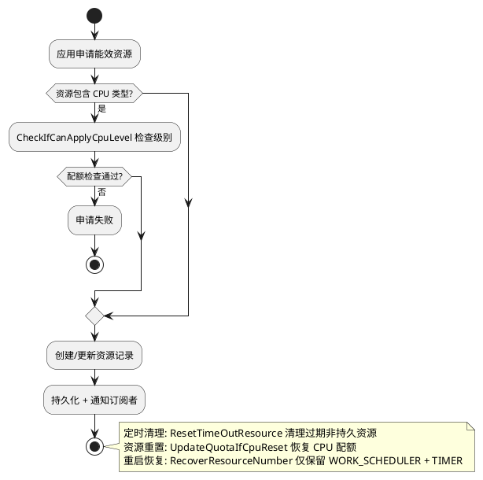

# 能效资源规格

> 文档版本：v1.0
> 更新时间：2026-08-19

## 实体概念

### 定义

能效资源（Efficiency Resources）是后台任务管理组件提供的一种资源特权申请机制。系统应用或系统进程可申请 CPU、软件资源、硬件资源等能效资源，获得在挂起状态下不被代理或不被挂起的特权，优化后台运行效率。

能效资源可以分为四种：CPU资源；WORK_SCHEDULER资源；软件资源(COMMON_EVENT, TIMER)；硬件资源(GPS, BLOOTOOTH, AUDIO)。应用或进程申请能效资源后能够获得相应特权，例如：申请CPU资源后可以不被挂起；申请WORK_SCHEDULER资源后不受延迟任务执行频率约束，且任务执行时间增加；申请软件、硬件资源后，相关资源在挂起状态下不被代理。

### 核心概念

| 概念　　　　　　　　　　　| 说明　　　　　　　　　　　　　　　　　　　　　　　　　　　　　　　|
| ---------------------------| -------------------------------------------------------------------|
| 资源类型（ResourceType）　| 位掩码枚举，标识 CPU/公共事件/计时器/延迟任务/蓝牙/GPS/音频等资源 |
| 持久资源（isPersist）　　 | 申请后持续生效，不因超时释放　　　　　　　　　　　　　　　　　　　|
| 非持久资源　　　　　　　　| 申请后在超时时间后自动释放　　　　　　　　　　　　　　　　　　　　|
| 应用级申请　　　　　　　　| 以应用 UID 为维度申请资源　　　　　　　　　　　　　　　　　　　　 |
| 进程级申请　　　　　　　　| 以进程 PID 为维度申请资源　　　　　　　　　　　　　　　　　　　　 |
| ResourceApplicationRecord | 服务端内部维护的资源申请记录　　　　　　　　　　　　　　　　　　　|

### 接口说明

| 接口名 | 接口描述 |
|--------|---------|
| `applyEfficiencyResources(request: EfficiencyResourcesRequest): boolean` | 申请能效资源 |
| `resetAllEfficiencyResources(): void` | 释放申请的能效资源 |

### 资源参数

| 参数名　　　　 | 参数值 | 描述　　　　　　　　　　　　　　　　 |
| ----------------| --------| --------------------------------------|
| CPU　　　　　　| 1　　　| CPU资源，申请后不被挂起　　　　　　　|
| COMMON_EVENT　 | 2　　　| 公共事件，申请后挂起状态下不被代理掉 |
| TIMER　　　　　| 4　　　| 计时器，申请后挂起状态下不被代理掉　 |
| WORK_SCHEDULER | 8　　　| 延迟任务，申请后有更长的执行时间　　 |
| BLUETOOTH　　　| 16　　 | 蓝牙相关，申请后挂起状态下不被代理掉 |
| GPS　　　　　　| 32　　 | GPS相关，申请后挂起状态下不被代理掉　|
| AUDIO　　　　　| 64　　 | 音频资源，申请后挂起状态下不被代理掉 |
| RUNNING_LOCK　 | 128　　| 电源锁，申请后挂起状态下不被代理掉　 |
| SENSOR　　　　 | 256　　| 传感器，申请后挂起状态下不被代理掉　 |

### 功能边界

- 能效资源申请不保证应用持续运行（需配合 CPU 资源才能不被挂起）
- 软件资源（公共事件/计时器）申请后在挂起状态下不被代理掉
- 硬件资源（GPS/蓝牙/音频）申请后在挂起状态下不被代理掉
- WORK_SCHEDULER 资源申请后放宽延迟任务执行频率约束

### 与短时/长时任务的区分

| 维度 | 能效资源 | 短时任务 | 长时任务 |
|------|---------|---------|---------|
| 目的 | 资源特权 | 短时运行 | 长期运行 |
| 时长 | 持久或超时 | 3 分钟 | 长期 |
| 通知 | 无 | 无 | 强制通知 |
| 粒度 | 应用级/进程级 | 应用级 | Ability 级 |

### 使用约束

- 能效资源申请或者释放可以由进程（仅CPU类型）或者应用发起，由应用发起的释放在释放的时候会释放所有资源，包括进程申请的资源。由进程发起的资源释放对应用申请的资源没有影响。
- 同时申请同一类持久资源和非持久资源，持久资源会覆盖非持久资源。在超时时不会释放资源。
- 在应用死亡时，会清空除了WORK_SCHEDULER之外的所有资源申请记录；在应用被卸载时，会清空所有的资源申请记录。
- 能效资源使用需要申请特权配置，CPUlevel使用需要申请特权配置

## 规则与约束

### 资源类型

`ResourceType` 枚举（定义于 `interfaces/innerkits/include/resource_type.h`），使用位掩码：

| 资源 | 枚举值 | 位掩码 | 说明 |
|------|--------|--------|------|
| `CPU` | 1 | 1 << 0 | CPU 资源，申请后不被挂起 |
| `COMMON_EVENT` | 2 | 1 << 1 | 公共事件，挂起状态下不被代理 |
| `TIMER` | 4 | 1 << 2 | 计时器，挂起状态下不被代理 |
| `WORK_SCHEDULER` | 8 | 1 << 3 | 延迟任务，更长执行时间 |
| `BLUETOOTH` | 16 | 1 << 4 | 蓝牙，挂起状态下不被代理 |
| `GPS` | 32 | 1 << 5 | GPS，挂起状态下不被代理 |
| `AUDIO` | 64 | 1 << 6 | 音频资源，挂起状态下不被代理 |
| `RUNNING_LOCK` | 128 | 1 << 7 | 运行锁 |
| `SENSOR` | 256 | 1 << 8 | 传感器 |

### 持久/非持久规则

- 同时申请同一类持久资源和非持久资源时，持久资源必须覆盖非持久资源
- 持久资源在超时时不得释放
- 非持久资源在超时后自动释放

### 生命周期约束

- 应用死亡时必须清理除 WORK_SCHEDULER 之外的所有资源申请记录
- 应用卸载时必须清理所有资源申请记录
- 由应用发起的资源释放必须释放所有资源，包括进程申请的资源
- 由进程发起的资源释放不影响应用申请的资源

### CPU 配额约束

- CPU 资源申请必须通过 `CheckIfCanApplyCpuLevel` 检查
- CPU 资源申请后通过 `CheckOrUpdateCpuApplyQuota` 更新配额
- CPU 资源重置时通过 `UpdateQuotaIfCpuReset` 恢复配额

## 取消原因

`CancelReason` 枚举（定义于 `bg_efficiency_resources_mgr.h`）：

| 枚举值　　　　　　　　　　　　　| 说明　　　　　　　　 |
| ---------------------------------| ----------------------|
| `DEFAULT`　　　　　　　　　　　 | 默认　　　　　　　　 |
| `DUMPER`　　　　　　　　　　　　| Dump 触发　　　　　　|
| `APPLY_INTERFACE`　　　　　　　 | 申请接口触发　　　　 |
| `RESET_INTERFACE`　　　　　　　 | 释放接口触发　　　　 |
| `APP_DIED`　　　　　　　　　　　| 应用死亡　　　　　　 |
| `APP_DIDE_TRIGGER_PROCESS_DIED` | 应用死亡触发进程死亡 |
| `PROCESS_DIED`　　　　　　　　　| 进程死亡　　　　　　 |

## 能效资源配额流程

### CPU Level 分级

`EfficiencyResourcesCpuLevel`（定义于 `interfaces/innerkits/include/efficiency_resources_cpu_level.h`）：

| 级别　　　　 | 枚举值 | 说明　　　　　　　　　　　　　|
| --------------| --------| -------------------------------|
| `DEFAULT`　　| -1　　 | 默认级别，应用未指定 CPU 级别 |
| `SMALL_CPU`　| 0　　　| 小 CPU 配额　　　　　　　　　 |
| `MEDIUM_CPU` | 1　　　| 中 CPU 配额　　　　　　　　　 |
| `LARGE_CPU`　| 2　　　| 大 CPU 配额　　　　　　　　　 |

### 配额流程概览

配额管理库动态加载、配额检查/更新/重置流程、超时资源清理流程、重启恢复流程及 Dump 配额管理命令等实现细节详见代码设计文档 `docs/design/efficiency_resources.md` 的"配额实现流程"章节。

## innerAPI 功能

从 `services/efficiency_resources/include/bg_efficiency_resources_mgr.h` 的关键方法表抽取的内部方法签名：

| 方法 | 签名 | 说明 |
|------|------|------|
| `ApplyEfficiencyResources` | `ErrCode ApplyEfficiencyResources(const sptr[EfficiencyResourceInfo] &resourceInfo)` | 申请能效资源 |
| `ResetAllEfficiencyResources` | `ErrCode ResetAllEfficiencyResources()` | 重置所有能效资源 |
| `GetAllEfficiencyResources` | `ErrCode GetAllEfficiencyResources(vector[EfficiencyResourceInfo] &resourceInfoList)` | 获取所有资源申请 |
| `GetEfficiencyResourcesInfos` | `ErrCode GetEfficiencyResourcesInfos(vector[ResourceCallbackInfo] &appList, vector[ResourceCallbackInfo] &procList)` | 获取应用级和进程级资源信息 |
| `AddSubscriber` | `ErrCode AddSubscriber(const sptr[IBackgroundTaskSubscriber] &subscriber)` | 添加订阅者 |
| `RemoveSubscriber` | `ErrCode RemoveSubscriber(const sptr[IBackgroundTaskSubscriber] &subscriber)` | 移除订阅者 |
| `RemoveProcessRecord` | `ErrCode RemoveProcessRecord(int32_t uid, int32_t pid, const std::string &bundleName)` | 移除进程记录 |
| `RemoveAppRecord` | `ErrCode RemoveAppRecord(int32_t uid, const std::string &bundleName, bool resetAll)` | 移除应用记录 |

## DFX 设计

### 可靠性设计

能效资源模块的错误码定义于 `frameworks/common/include/bgtaskmgr_inner_errors.h`，专属错误码段为 `1870001`，覆盖资源数超限/参数非法（`ERR_BGTASK_RESOURCES_EXCEEDS_MAX`）、PID/UID 非法（`ERR_BGTASK_RESOURCES_INVALID_PID_OR_UID`）、CPU 级别相关（`ERR_BGTASK_EFFICIENCY_RESOURCES_CPU_LEVEL_INVALID`/`NOT_ALLOW_APPLY`/`INVALID_BUNDLE_INFO`/`APP_SIGNATURES_INVALID`/`TOO_LARGE`）、序列化与服务就绪（`ERR_BGTASK_RESOURCES_PARCELABLE_FAILED`/`SYS_NOT_READY`/`SERVICE_NOT_CONNECTED`）等场景。

资源申请记录持久化落盘到 `resource_record` 文件，采用 JSON 格式。每次申请/释放/超时清理/Dump 后均必须触发落盘，保证内存与磁盘最终一致。

重启恢复：服务重启时从盘读回记录，按运行 uid/pid 过滤失效记录。重启保留策略仅保留 `WORK_SCHEDULER` 与 `TIMER` 两类资源，其余资源类型重启即失效。系统启动一定时长内执行资源数量清算。超时任务按剩余时间重新投递清理任务，持久资源（persist）不投递超时清理。

超时资源自动清理：定期扫描非持久资源，到期后按位掩码清除并更新 CPU 配额，发 HiSysevent 与订阅回调。

应用死亡/进程死亡/应用卸载清理：应用死亡时清理除 `WORK_SCHEDULER` 外的资源；进程死亡时清理除 `WORK_SCHEDULER` 与 `TIMER` 外的资源；应用卸载时全清。应用死亡级联清理其进程记录。

并发保护：所有申请/释放/订阅/超时操作经 handler 投递到单 EventRunner 串行化执行；`isSysReady` 原子状态门控，依赖服务齐备后置就绪，任一丢失置未就绪并拒绝写请求。

### 安全性设计

仅系统应用或 ServiceExtension 类型进程可申请/释放能效资源，非系统应用必须返回非系统应用错误码。

资源申请特权来自 bundle 包配置的 `resourcesApply` 字段：0 表示全部资源，1~9 对应 CPU/COMMON_EVENT 等（按位掩码映射），未授权的资源类型必须返回权限拒绝。

CPU Level 申请实施白名单加签名校验链：bundleName 须在配置白名单内、应用签名须匹配、cpuLevel 不得超过配置上限。默认场景（应用未设 cpuLevel 为 DEFAULT）直接放行以兼容旧应用。

`GetEfficiencyResourcesInfos` 在 Stub 层强制 `CheckCallingToken`，仅 `TOKEN_NATIVE`/`TOKEN_SHELL` 可调用。

Dump 诊断入口需同时满足 ENG 模式与 `ohos.permission.DUMP` 权限。

BundleMgr 死亡重连：持有死亡监听，远端死亡时断连，下次调用自动重连。

### 可扩展设计

ResourceType 位掩码可扩展：`ResourceType` 枚举为位掩码，新增资源类型只需追加枚举值与 Name 表项，`MAX_RESOURCE_MASK` 由表大小派生，申请/释放/超时遍历自动适配。

CPU Level 分级扩展：`EfficiencyResourcesCpuLevel` 枚举（DEFAULT/SMALL_CPU/MEDIUM_CPU/LARGE_CPU），新增分级只需在 END 前插入枚举值与字符串映射。

订阅者机制扩展：维护订阅者列表，支持应用级与进程级资源申请/重置四类事件分发，订阅者死亡自动清理。

### 可配置设计

配置文件 `etc/backgroundtask/config.json` 承载 CPU 能效资源申请白名单，每项含 `bundleName`/`appSignatures`/`cpuLevel`，经 config_policy 解析。

### 可测试性设计

日志：统一 `BGTASK_LOG*` 宏，能效资源专用 LOG_TAG 为 `RESOURCE_TASK`，含隐私格式化标注。

HiSysevent 事件埋点：`EFFICIENCY_RESOURCE_APPLY`（申请）与 `EFFICIENCY_RESOURCE_RESET`（释放），均为 `CRITICAL` 级别且 `preserve=true`，携带 UID/PID/包名/资源类型/超时/persist/进程等字段。批量上报缓冲：累积 20 条后 flush 落盘。落盘后额外上报用户数据大小事件监控目录占用。

Dump 诊断：`hidumper` 调用，`-E` 路由到能效资源，支持 `--all`（列出全部记录含资源类型/persist/剩余时间/reason）、`--reset_all`（全清）、`--resetapp`/`--resetproc`（单点清理）、`--setquota`/`--resetquota`/`--getquota`（CPU 配额管理）。

HiTrace 在关键 IPC 方法标注链路追踪。

### 兼容性设计

`isPersist_` 标记位控制资源是否持久（无超时），持久化 JSON 字段 `isPersist` 向后兼容，旧版记录可正常解析。

`cpuLevel` 字段为 2025 新增：向后兼容处理包括——旧应用未设 cpuLevel（DEFAULT）时直接放行不触发白名单校验；JSON 反序列化对 `cpuLevel` 可选解析，旧版无该字段不报错；IPC 读取失败回退 DEFAULT；查询接口仅在非 DEFAULT 时回填，DEFAULT 不下发以兼容旧消费方；NAPI 侧 `cpuLevel` 为可选字段。

重启保留 `WORK_SCHEDULER` 与 `TIMER` 的跨服务重启语义，确保这两类长时后台资源与短时定时场景不中断。

SysCap 声明 `SystemCapability.ResourceSchedule.BackgroundTaskManager.EfficiencyResourcesApply`。
